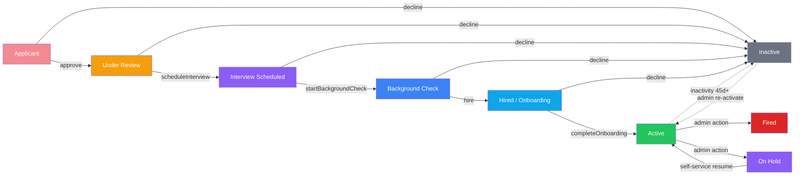

# Implementation Priorities

> Reference wireframe: `sitterwise_wireframe_v2.html` — 7 screens covering onboarding, cancellation, milestones, pause, admin dashboard, interview eval, assignments view.

## ✅ Completed

### 1. Fix relational records from wizard data
All wizard-to-relational-record mappings implemented in `CaregiverApplicationController@submit()`:

- `age_groups` → `specialty_types` sync (babies→id:1, toddlers→id:2, preschool→id:3, school_age→id:4)
- `location` → `locations` sync with flexible logic (north_county→North County, south_east_county→South County, flexible→metadata)
- `education.*` → `CaregiverEducation` records with degree + expanded education_type
- Attribute matches: `petsitting`→`pet_sitting`, `driving`→`has_vehicle`, `smokes=no`→`non_smoker`
- Caregiver columns set: `biography`, `languages`, `education_level`, `metadata`
- All syncs defensive (query existing IDs first) — works with or without seed data

Admin specialty/location/education/attribute sections now populate immediately on submission.

#### Wizard → Database Field Mapping

| Wizard Step | Form Field | Destination Table | Destination Column |
|---|---|---|---|
| **Step 1** | `sponsor.first_name` | `reference_requests` | `reference_name` (as "First Last") |
| | `sponsor.last_name` | `reference_requests` | `reference_name` (as "First Last") |
| | `sponsor.email` | `reference_requests` | `reference_email` |
| | `sponsor.phone` | `caregiver_applications.data` | `data->sponsor.phone` |
| | `sponsor.relationship` | `reference_requests` | `relationship` |
| | `personal.first_name` | `caregivers` | `first_name` |
| | | `users` | `name` (as "First Last") |
| | `personal.last_name` | `caregivers` | `last_name` |
| | | `users` | `name` (as "First Last") |
| | `personal.email` | `caregiver_applications.data` | `data->personal.email` (session email used for `users.email`) |
| | `personal.phone` | `caregivers` | `phone` |
| | `personal.dob` | `caregivers` | `date_of_birth` |
| | `personal.photo` | Storage `photos/` | path stored in `caregiver_applications.data->personal.photo` (frontend upload disabled, backend logic intact) |
| | `personal.address_line1` | `caregivers` | `address_line1` |
| | `personal.address_line2` | `caregivers` | `address_line2` |
| | `personal.address_city` | `caregivers` | `address_city` |
| | `personal.address_state` | `caregivers` | `address_state` |
| | `personal.address_zip` | `caregivers` | `address_zip` |
| **Step 2** | `position.babysitting` | `caregiver_applications.data` | `data->position.babysitting` |
| | `position.petsitting` | `entity_attribute_values` | `attribute_definition_id=1` (pet_sitting) |
| | `position.group_events` | `caregiver_applications.data` | `data->position.group_events` |
| | `availability.*` | `caregivers` | `metadata->availability` (JSON) |
| | `availability.notes` | `caregivers` | `metadata->availability.notes` (JSON) |
| | `education.level` | `caregiver_educations` | `education_type` |
| | | `caregivers` | `education_level` |
| | `education.college` | `caregiver_educations` | `school_name` (when level != high_school) |
| | `education.graduation_year` | `caregiver_educations` | `graduation_year` (when level != high_school) |
| | `education.degree` | `caregiver_educations` | `degree` (when level != high_school) |
| | `education.high_school_name` | `caregiver_educations` | `school_name` (when level = high_school) |
| | `education.high_school_graduation_year` | `caregiver_educations` | `graduation_year` (when level = high_school) |
| **Step 3** | `employment_status` | `caregivers` | `metadata->employment_status` (JSON) |
| | `current_employer` | `caregivers` | `metadata->current_employer` (JSON) |
| | `experiences[*].*` | `caregiver_applications.data` | `data->experiences[*]` (JSON — not stored as relational records) |
| **Step 4** | `smokes` | `caregivers` | `metadata->smokes` (JSON) |
| | | `entity_attribute_values` | `attribute_definition_id=4` (non_smoker, when smokes=no) |
| | `alcohol` | `caregivers` | `metadata->alcohol` (JSON) |
| | `substance_abuse` | `caregivers` | `metadata->substance_abuse` (JSON) |
| | `limitations` | `caregivers` | `metadata->limitations` (JSON) |
| | `allergic_to_pets` | `caregivers` | `metadata->allergic_to_pets` (JSON) |
| | `allergic_to_what` | `caregiver_applications.data` | `data->allergic_to_what` |
| | `visible_tattoos` | `caregivers` | `metadata->visible_tattoos` (JSON) |
| | `tattoo_description` | `caregiver_applications.data` | `data->tattoo_description` |
| | `authorized_to_work` | `caregivers` | `metadata->authorized_to_work` (JSON) |
| | `reliable_vehicle` | `caregivers` | `metadata->reliable_vehicle` (JSON) |
| | `cpr_certified` | `caregivers` | `metadata->cpr_certified` (JSON) |
| | `cpr_expiration` | `caregiver_certifications` | `expiration_date` (certification_type = CPR) |
| | | `caregivers` | `metadata->cpr_expiration` (JSON) |
| | `cpr_card` | Storage `cpr-cards/` | path stored in `caregiver_certifications.file_path` + `caregiver_applications.data->cpr_card` |
| | `trustline_certified` | `caregivers` | `metadata->trustline_certified` (JSON) |
| | `trustline_upload` | Storage `trustline-uploads/` | path stored in `caregiver_certifications.file_path` (certification_type = Trustline) |
| | `languages` | `caregivers` | `languages` (JSON) |
| | `has_children` | `caregivers` | `metadata->has_children` (JSON) |
| | `children_ages` | `caregiver_applications.data` | `data->children_ages` |
| **Step 5** | `references[*].*` | `reference_requests` | one record per reference with `first_name`, `last_name`, `email`, `relationship`, `years_known` |
| **Step 6** | `location.north_county` | `caregiver_locations` | `location_id=2` (North County) |
| | `location.south_east_county` | `caregiver_locations` | `location_id=1` (South County) |
| | `location.flexible` | `caregivers` | `metadata->location_flexible` (JSON) |
| | `age_groups.babies` | `caregiver_specialties` | `specialty_type_id=1` |
| | `age_groups.toddlers` | `caregiver_specialties` | `specialty_type_id=2` |
| | `age_groups.preschool` | `caregiver_specialties` | `specialty_type_id=3` |
| | `age_groups.school_age` | `caregiver_specialties` | `specialty_type_id=4` |
| **Step 7** | `qualifications.*` | `caregiver_applications.data` | `data->qualifications` (JSON) |
| | `qualifications.driving` | `entity_attribute_values` | `attribute_definition_id=3` (has_vehicle) |
| | `things_i_bring` | `caregivers` | `metadata->things_i_bring` (JSON) |
| | `bio` | `caregivers` | `biography` |
| | `interests` | `caregivers` | `metadata->interests` (JSON) |
| **Step 8** | `verification.signature` | `caregiver_agreements` | signed PDF stored; name stored in `caregiver_applications.data` |
| | `verification.agree` | `caregiver_agreements` | `type=verification`, `signed_at` set |
| | `agreement.signature` | `caregiver_agreements` | signed PDF stored; name stored in `caregiver_applications.data` |
| | `agreement.agree` | `caregiver_agreements` | `type=agreement`, `signed_at` set |

### 2. Expand reference form to spec

- Migration: added 6 rating columns + strengths/concerns/additional_comments, dropped old rating/feedback
- Frontend: `submit.tsx` rewritten with 6 per-category `StarRating` controls + 3 text fields
- Backend: `SubmitReferenceRequest` validation + `ReferenceController` store updated
- Admin caregiver profile: composite average badge with expandable 6-category detail + strengths/concerns/comments
- Application show page: same composite avg + expandable detail
- Tests rewritten for new field names

### Specialty type colors
`color_bg`/`color_text` columns added to `specialty_types`. "Special Needs" record removed (collected as qualification, not age-group). Colors seeded on 4 records. Frontend `SpecialtyTag` reads from DB props instead of hardcoded map.

### Wizard Steps 4 cleanup
Removed `skills.*` fields (special_needs, swimming, driving, bilingual, other) from wizard — they overlapped with Step 7 qualifications. Validation rules and `defaultFormData` updated accordingly.

### Low #1 — Admin caregiver profile tabs — ✅ Completed

Tabbed profile layout in `resources/js/pages/admin/caregivers/show.tsx`:

- 8 tabs: Summary, Application, References, Reviews, Internal Rating, Job History, Compliance, Notes
- Summary is the default/leftmost tab (wireframe match)
- Deferred props for Reviews and Job History (lazy-loaded)
- Job History table with resolution badges, late-arrival flags, client links

**Files:** `resources/js/pages/admin/caregivers/show.tsx`

**Wireframe:** "Caregiver Assignments View" screen — profile header, 7 tabs, Job History table.

### Low #2 — Self-service hold/resume + inactivity automation — ✅ Completed

**Self-service pause (caregiver-facing):**
- Pause form at `/settings/caregiver/pause` with optional `resume_by` date and `pause_reason`
- One-tap resume on same screen, no admin required
- Status transitions: Active ↔ On Hold (pause/resume)
- `CaregiverPause` model + factory, `paused_at`/`resume_by`/`pause_reason`/`resumed_at` columns

**Admin resume:**
- `POST /admin/caregivers/{caregiver}/resume` route (admin middleware)
- `CaregiverController@resumeCaregiver()` — sets status to Active, marks `resumed_at`
- Pause info card in admin sidebar with Resume button
- 3 tests: admin resume, no active pause error, non-admin 403

**Inactivity automation (Artisan commands):**
- `app:check-in-on-hold-caregivers` — 3-tier mail at 30/45/60d
- `app:archive-long-term-inactive` — 166d warning, 180d archive to Inactive
- `AdminCaregiverArchivedMail` queued to all admin + super_admin users on archive
- `CaregiverOnHoldCheckinMail` (3 tiers: checkin, reminder, final)
- `CaregiverArchiveWarningMail` at 166d

**Tests:** 12 tests in `CaregiverPauseTest.php`

**Wireframe:** Full design in "Pause Account" screen — hold card with form, callout explaining resume.

### Low #3 — Caregiver cancellation flow — ✅ Completed

**Backend — `AssignmentController` with 4 actions:**
- `backOut()` — caregiver back-out with required reason
- `excuse()` — marks excused with optional note
- `logNoShow()` — no-show resolution
- `logLateArrival()` — late arrival flag (always available, even after final resolution)
- Booking status stays `Confirmed` — resolution on assignment, not booking
- `app:check-late-arrivals` daily at 11:00 flags 3+ late arrivals in 60 days

**Admin notification:** `AdminCaregiverBackedOutMail` (queueable Blade view) sent to all admins.

**Frontend — caregiver jobs page:** Cancel Job button + cancellation Dialog (wireframe match).

**Frontend — admin job history:** Resolution badges + Excuse/No-Show/Late dialogs.

**Tests:** 11 tests in `CaregiverCancellationTest.php`

**Wireframe:** "Cancellation Flow" screen — modal with job summary, warning, reason field.

### Email footer standardization — ✅ Completed

Standardized footer across all 17 email templates:
- `This is an automated notification from Sitterwise.`
- `Sitterwise — San Diego's most trusted childcare agency.`

Each template had existing content preserved (reference-specific, booking-specific text) with missing lines appended. `reference-completed` had old copy replaced with standardized version.

### Wizard frontend validation + CPR enforcement — ✅ Completed

Implemented comprehensive frontend validation across all 8 wizard steps, blocking forward navigation (Next button + step number clicks) when required fields are empty:

**`validateStep()` function** (`wizard.tsx`):
- Step 1: sponsor first/last/email, personal first/last/phone/email/dob/address — all checked
- Step 2: at least one position required
- Step 3: employment status, current employer (if employed), start date/description/ages_served per experience
- Step 4: existing conditional checks + **new** `cpr_expiration` and `cpr_card` required when `cpr_certified = yes`
- Step 5: all 6 fields per reference required
- Step 6: at least one location required
- Step 7: bio required
- Step 8: both signatures + both agree checkboxes required

**`goToStep()` and `nextStep()`** — both call `validateStep()` before forward navigation; backward navigation unrestricted

**Inline errors** — 24 `<p className="text-sm text-destructive">` tags added beneath every validated field across all 8 steps

**`*` markers added:**
- Step 2 — Position group label
- Step 3 — Ages served label
- Step 6 — Location group label

**Backend (`StoreCaregiverApplicationRequest.php`):**
- `cpr_expiration`: added `required_if:cpr_certified,yes`
- `cpr_card`: added `required_if:cpr_certified,yes`
- Location: added `withValidator` check requiring at least one location

**Tests:**
- Added `cpr_card` fake file to test helper
- 3 new validation tests: cpr_card required, cpr_expiration required, location required
- Updated existing CPR=no test to also unset cpr_card
- 821 tests passing (1 pre-existing failure, 6 skipped)

**ConvertPhoneNumbersToE164 fix:** replaced `bookings.client_phone` entry (column migrated to `booking_groups`) with `booking_groups.client_phone`

## Caregiver Lifecycle Flow



**Onboarding barrier** (blocks `Hired/Onboarding → Active`):

```
┌──────────────────────────────────────────────┐
│          Onboarding Checklist                 │
├──────────────────────────────────────────────┤
│ ☐ OnPay setup complete (admin emails self)   │
│ ☐ Background check clear                     │
│ ☐ CPR uploaded and valid                     │
│ ☐ Trustline submitted                        │
│ ☐ Dress code acknowledged                    │
│ ☐ Training quiz passed                       │
├──────────────────────────────────────────────┤
│ ➜ All 6 done → completeOnboarding → Active   │
│ ➜ >30d stalled → auto-revert to Inactive     │
└──────────────────────────────────────────────┘
```

## High (foundational — fix existing gaps, complete Phase 1-2 core)

### High #1 — Stalled application nudges (§4.1) — ✅ Completed

#### Implementation

**Tracking:**
- `IncompleteApplication` model (`app/Models/IncompleteApplication.php`) with scopes: `needsNudge` (48h inactive + not nudged recently), `stale` (14d+), `expired` (90d+)
- Migration: `database/migrations/2026_05_24_095326_create_incomplete_applications_table.php`
- `CaregiverApplicationController@saveProgress()` creates/updates tracking on each step save
- `CaregiverApplicationController@submit()` deletes tracking record on successful submission

**Commands:**
- `app:nudge-incomplete-applications` — sends `ApplicantResumeApplicationMail` at 48h (nudge_count 0→1), sends `ApplicantFinalReminderMail` at 7d (nudge_count 1→2)
- `app:archive-stalled-applications` — sets `archived_at` at 14d, hard-deletes at 90d

**Mailables + Templates:**
- `app/Mail/ApplicantResumeApplicationMail.php` → `resources/views/emails/resume-application.blade.php`
- `app/Mail/ApplicantFinalReminderMail.php` → `resources/views/emails/final-reminder.blade.php`
- Both queued, following existing project email patterns

**Scheduling:**
- `app:nudge-incomplete-applications` → every 6 hours via `routes/console.php`
- `app:archive-stalled-applications` → daily via `routes/console.php`

**Tests:** 25 tests covering model scopes, both nudge tiers, archive/deletion, idempotency, and integration with saveProgress/submit endpoint.

**Files created/modified:**
| File | Action |
|------|--------|
| `app/Models/IncompleteApplication.php` | Created |
| `database/migrations/..._create_incomplete_applications_table.php` | Created |
| `app/Console/Commands/NudgeIncompleteApplications.php` | Implemented handle() |
| `app/Console/Commands/ArchiveStalledApplications.php` | Implemented handle() |
| `app/Mail/ApplicantResumeApplicationMail.php` | Implemented |
| `app/Mail/ApplicantFinalReminderMail.php` | Implemented |
| `resources/views/emails/resume-application.blade.php` | Created |
| `resources/views/emails/final-reminder.blade.php` | Created |
| `routes/console.php` | Added scheduling |
| `tests/Feature/CaregiverIncompleteApplicationTest.php` | Created (25 tests) |

**Impact:** New feature — directly affects lead conversion by recovering abandoned applications.

**Wireframe:** Not shown — backend workflow, no frontend screen.

## Medium (complete the pipeline — reference lifecycle, admin workflow)

### Medium #1 — Reference nudges (§5.5) — ✅ Completed

#### Implementation

**Command:** `app:nudge-pending-references {--reference-side} {--applicant-side}`
- No flag = runs both sides

**Reference-side nudges:**
- Day 2–4: sends `ReferenceReminderMail` to pending references
- Day 5+: sends `ReferenceFinalReminderMail` to pending references
- Uses `created_at` with date windows — no schema changes needed

**Applicant-side nudges:**
- Day 3–6: sends `ApplicantPendingReferencesMail` (similar tone to first reminder)
- Day 7–13: sends same mail with stronger wording ("over a week")
- Day 14+: sets caregiver status to `Inactive` (stalled)

**Files created:**

| File | Action |
|------|--------|
| `app/Console/Commands/NudgePendingReferences.php` | Created |
| `app/Mail/ReferenceReminderMail.php` | Created |
| `app/Mail/ReferenceFinalReminderMail.php` | Created |
| `app/Mail/ApplicantPendingReferencesMail.php` | Created |
| `resources/views/emails/reference-reminder.blade.php` | Created |
| `resources/views/emails/reference-final-reminder.blade.php` | Created |
| `resources/views/emails/applicant-pending-references.blade.php` | Created |
| `routes/console.php` | Added scheduling (daily at 9am) |
| `tests/Feature/ReferenceNudgeTest.php` | Created (12 tests) |

**Tests:** 12 tests covering: first/final reminder delivery, skip completed/too-recent/archived, applicant prompts at day 3/7/14, cross-flag isolation, combined mode.

**Wireframe:** Not shown — backend scheduled commands.

### High #2 — Application lifecycle workflow — ✅ Completed

#### Current Implementation

**Enum status transitions (as implemented):**
- `Applicant` → approve() → `UnderReview`
- `UnderReview` → scheduleInterview() → `InterviewScheduled`
- `InterviewScheduled` → startBackgroundCheck() → `BackgroundCheck`
- `BackgroundCheck` → hire() → `HiredOnboarding`
- `HiredOnboarding` → completeOnboarding() → `Active`

**New enum values added to `CaregiverStatus`:**
- `UnderReview` ("Under Review", color `#F59E0B`)
- `InterviewScheduled` ("Interview Scheduled", color `#8B5CF6`)
- `BackgroundCheck` ("Background Check", color `#3B82F6`)
- New `terminal()` helper returning [Active, Inactive, NonStarter, Fired, Ineligible, OnHold]
- **Gap:** `Hired/Onboarding` status not yet added to enum. `hire()` currently jumps to `Active` — must transition to `Hired/Onboarding` instead. Onboarding checklist (#10) gates the `Hired/Onboarding → Active` transition.

**Backend:**
- `ApplicationController` gained 5 action methods: `approve()`, `scheduleInterview()`, `startBackgroundCheck()`, `hire()`, `decline()`
- Each validates current status and rejects invalid transitions with 422
- `ApplicationActionRequest` validates admin authorization and optional decline note
- `ApplicantDeclinedMail` + template sends decline notification to applicant with optional reason
- All routes added under admin middleware

**Frontend — `applications/show.tsx`:**
- New "Status" sidebar card with colored badge and pipeline action buttons
- Buttons conditionally rendered per current status (only valid forward transitions shown)
- "Decline" always available on non-terminal states
- Optional "Add reason" textarea for decline (toggleable)
- Confirmation dialog before each action
- Loading/disabled state during requests

**Frontend — `applications/index.tsx`:**
- New "Status" column with colored badge per application
- Status filter dropdown (`?status=` query param)
- Controller reads filter and scopes query by caregiver status

**Files created/modified:**

| File | Action |
|------|--------|
| `app/Enums/CaregiverStatus.php` | Added UnderReview, InterviewScheduled, BackgroundCheck + terminal() |
| `app/Http/Controllers/ApplicationController.php` | Added 5 action methods + status filter in index() |
| `app/Http/Requests/ApplicationActionRequest.php` | Created |
| `app/Mail/ApplicantDeclinedMail.php` | Created |
| `resources/views/emails/application-declined.blade.php` | Created |
| `routes/web.php` | Added 5 admin routes |
| `resources/js/pages/applications/show.tsx` | Added pipeline action card + status badge |
| `resources/js/pages/applications/index.tsx` | Added status column + filter |
| `tests/Unit/Models/CaregiverStatusTest.php` | Updated for new cases + terminal() test |
| `tests/Feature/ApplicationLifecycleTest.php` | Created (15 tests) |

**Tests:** 15 tests covering all forward transitions, invalid transition rejections, decline from multiple statuses, decline email with note, terminal status rejection, admin authorization, and status filter.

**Wireframe:** Implied by interview eval "Save & advance to background check" button. No dedicated screen.

#### Refactor: Drive status badge metadata from backend enum

Removed duplicated status data (badge colors, labels, terminal list) from frontend components by sharing `CaregiverStatus::toArray()` globally via Inertia.

**Changes:**
- `app/Enums/CaregiverStatus.php` — Added `toArray()` returning all 12 cases with `value`, `label`, `color`, `is_terminal`
- `app/Http/Middleware/HandleInertiaRequests.php` — Shared `caregiverStatuses` globally
- `resources/js/types/global.d.ts` — Added `CaregiverStatusOption` type
- `resources/js/pages/applications/index.tsx` — Removed hardcoded `statusBadgeColors` and `statusOptions`; filter dropdown and badge colors now driven from shared props with inline styles
- `resources/js/pages/applications/show.tsx` — Removed hardcoded `TERMINAL_STATUSES` and `statusBadgeColors`; `getActions()` receives shared array and checks `is_terminal` instead; badges use inline styles from shared color
- `tests/Unit/Models/CaregiverStatusTest.php` — Added test for `toArray()` structure (all 12 entries, terminal subset verified)

**Impact:** Single source of truth for all status metadata on both backend and frontend.

### High #3 — Onboarding checklist + Trustline/CPR tracking (§7, wireframe) — ✅ Completed (core pipeline)

**Pipeline fix:** `hire()` now transitions to `Hired/Onboarding` (not `Active`). Checklist gates `Hired/Onboarding → Active`.

**Implementation:**

**Enum:**
- ✅ `CaregiverStatus::HiredOnboarding = 'hired_onboarding'` with label "Hired / Onboarding", color `#0EA5E9`
- ✅ NOT added to `terminal()` (non-terminal — can still be declined)

**Controller:**
- ✅ `ApplicationController@hire()` transitions to `HiredOnboarding` instead of `Active`, seeds 6 checklist items
- ✅ `ApplicationController@completeOnboarding()` validates all 6 items completed, transitions to `Active`
- ✅ `ApplicationController@toggleChecklistItem()` — toggles individual item's `completed_at`
- ✅ Routes: `POST /applications/{application}/complete-onboarding`, `POST /applications/{application}/checklist/{checklistItem}/toggle`

**Database:**
- ✅ `onboarding_checklist_items` table with `caregiver_id`, `item_key`, `label`, `description`, `completed_at`
- ✅ 6 items seeded on hire via `OnboardingChecklistItem::seedForCaregiver()`

**Frontend — Admin:**
- ✅ Checklist panel in sidebar (hired_onboarding status only): 6 toggleable items with checkmark/line-through
- ✅ "Complete Onboarding" action button
- ❌ Trustline countdown banner — deferred (separate item)
- ❌ Trustline reimbursement tracking table — deferred
- ❌ CPR expiration renewal reminders — deferred

**Email (deferred — separate items):**
- ❌ Onboarding nudges: 48h, 7d, 14d
- ❌ 30d auto-revert to Inactive
- ❌ Admin alert when onboarding stalls

**OnPay handoff:**
- ✅ Checklist item #1: "OnPay Setup" — admin ticks after sending invite

**Edge cases:**
- ❌ Rehire edge case — deferred (low volume, handle when needed)
- ❌ Certification expirations during onboarding: show warning — deferred

### Medium #2 — Needs Attention widget + Applications Ready queue (§15.1, wireframe) — ✅ Completed

#### Implementation

**Backend — `DashboardController@index`:**
- Added `needsAttention` array to `$adminData` with all 8 queue counts

| Queue | Logic | Status |
|-------|-------|--------|
| No-shows today | Placeholder (needs cancellation flow) | 0 |
| Applications ready | Caregiver `Applicant` + submitted app + (≥2 refs OR 14d) | Live |
| Onboarding stalled >7d | Hired/Onboarding caregivers, created 7d+ ago | Live |
| Trustline suspended | Placeholder (needs Trustline feature) | 0 |
| Compliance expired | Certifications past expiration (expires_required) | Live |
| Compliance expiring | Certifications expiring this month | Live |
| Inactive 45+ days | Inactive status + updated_at > 45d ago | Live |
| Stuck references | Pending refs created 7d+ ago | Live |

**Frontend — `dashboard/admin.tsx`:**
- New "Needs Attention" card placed between summary panels and two-column layout
- Each row: emoji icon + label + color-coded count badge (urgent/warning/default) + chevron
- Zero-count queues shown muted as placeholders for future features
- Total count pill in card header

**Files modified:** `app/Http/Controllers/DashboardController.php`, `resources/js/pages/dashboard/admin.tsx`

**Wireframe:** Full design in "Admin Dashboard" screen — 8-queue widget with count badges.

### Medium #3 — Self-service reference status for applicants — ✅ Completed

#### Implementation

**Token-based access:**
- Migration: added `status_token` (nullable unique string) to `caregivers` table
- `CaregiverApplicationController@submit()` generates a 32-char `status_token` on caregiver creation
- Public route: `GET /caregiver/apply/status/{token}` — no auth required, token-based
- Replace route: `POST /caregiver/apply/status/{token}/replace-reference/{referenceRequest}`

**Frontend — `public/caregiver-apply/application-status.tsx`:**
- Shows application status badge (color-coded from shared `caregiverStatuses`)
- Lists all references with completed/pending badges
- "Replace" button on pending references opens inline form (name, email, relationship)
- "Save & Re-send" deletes old response data, resets token, and re-queues `ReferenceRequestMail`

**Email integration:**
- `ApplicantConfirmationMail` now accepts `$statusToken` and renders a "Track Your Application Status" button in the email body

**Files created/modified:**
| File | Action |
|------|--------|
| `database/migrations/2026_05_24_112710_add_status_token_to_caregivers.php` | Created |
| `app/Models/Caregiver.php` | Added `status_token` to fillable |
| `app/Http/Controllers/CaregiverApplicationController.php` | Added `showStatus()`, `replaceReference()`, token generation in `submit()` |
| `app/Mail/ApplicantConfirmationMail.php` | Added `$statusToken` param, `$statusUrl` to view |
| `resources/views/emails/applicant-confirmation.blade.php` | Added status tracking button + link |
| `resources/js/pages/public/caregiver-apply/application-status.tsx` | Created |
| `routes/web.php` | Added 2 public routes |

**Wireframe:** Not shown — designed from spec requirements.

### Medium #4 — Interview evaluation form (§11.2–11.4, wireframe) — ✅ Completed

#### Implementation

| Component | Details |
|-----------|---------|
| **Migration** | `caregiver_interviews` table — caregiver_id, evaluator_id, application_id, scores (JSON), composite (0-36), notes (text), status (draft/declined/completed), evaluated_at |
| **Model** | `CaregiverInterview` with casts for scores/array and composite/int, relationships to caregiver/evaluator/application |
| **Controller** | `InterviewController` with `create()` (shows form) and `store()` (saves evaluation) |
| **Validation** | `StoreInterviewEvaluationRequest` — 9 dimension scores (1-4 each), required notes, status enforcement |
| **Lifecycle hook** | `store()` transitions caregiver status: `completed` → `BackgroundCheck`, `declined` → `Inactive` |
| **Frontend** | `admin/interviews/evaluate.tsx` — matches wireframe exactly: candidate header, 4-heart scale legend, 6 soft skills + 3 professionalism rows with heart selectors, auto-calculated composite (X/36 + %), required notes textarea, 3 action buttons (Save draft, Decline candidate, Save & advance) |
| **Application show** | "Evaluate Interview" link appears in sidebar when status is `interview_scheduled` |
| **Routes** | `GET/POST /applications/{application}/interview` (admin middleware) |

**Files created:**
- `database/migrations/2026_05_24_113004_create_caregiver_interviews_table.php`
- `app/Models/CaregiverInterview.php`
- `app/Http/Controllers/InterviewController.php`
- `app/Http/Requests/StoreInterviewEvaluationRequest.php`
- `resources/js/pages/admin/interviews/evaluate.tsx`

**Wireframe:** Full design in "Interview Evaluation" screen — candidate context header, legend, 9 dimension rows, composite bar, notes, 3 action buttons.

## Low (future phases — add after core flow is solid)

### Low #1 — Admin caregiver profile tabs (§16.2, wireframe) — ✅ Completed
See completed section above. 8 tabs with deferred props for reviews/job history.

### Low #2 — Self-service hold/resume + inactivity automation (§14, wireframe) — ✅ Completed
See completed section above. Self-service pause/resume + admin resume + 3-tier check-in + 180d archive.

### Low #3 — Caregiver cancellation flow (§9, wireframe) — ✅ Completed
See completed section above. Back-out/excuse/no-show/late-arrival actions + admin notification + 11 tests.

### Low #4 — Internal rating system (§11.5–11.8) — ✅ Completed

Implemented in prior session. See session progress notes for full details.

| Component | Files | Tests |
|-----------|-------|-------|
| Migration | `database/migrations/..._create_caregiver_internal_ratings_table.php` — caregiver_id (unique FK), communication_score/notes/updated_at, reliability_score/override/cached_at, composite_score; seeds from `admin_rating` | — |
| Model | `app/Models/CaregiverInternalRating.php` — `decimal:2` casts, `effectiveReliability()` helper, `caregiver()` BelongsTo; `HasOne internalRating()` on Caregiver | — |
| API | `CaregiverController@updateAdminRating` — writes to both legacy `admin_rating` + new `communication_score`/`notes`; `@updateReliabilityOverride` — saves/clears override | — |
| Command | `app:recalculate-reliability {--caregiver=}` — reliability formula (backs × 0.5 penalty, floor(completed/10) × 0.1 bonus), composite formula (20/30/50 weighted, re-proportioned when components missing) | — |
| Hooks | `Artisan::queue('app:recalculate-reliability')` in `AssignmentController@backOut`, `@excuse`, `@logNoShow` | — |
| Schedule | Daily at 02:00 via `routes/console.php` | — |
| Frontend | Internal Rating tab in `admin/caregivers/show.tsx` — 3 sections: Communication (rating + notes), Reliability (auto-score + override), Composite (read-only weighted with breakdown) | — |
| Tests | `tests/Feature/CaregiverInternalRatingTest.php` — 12 tests | ✅ All pass |

**Wireframe:** Not shown — backend system feeding profile display.

### Low #5 — Client reviews & ratings (§8) — ✅ Completed

Implemented in this session. All items complete.

| Feature | Status | Files |
|---------|--------|-------|
| Quick rating (`POST /jobs/{booking}/rate`) | ✅ Complete | `JobController::rate()` |
| Full review + tip flow (logged-in) | ✅ Complete | `BookingReviewController`, `client/reviews/create.tsx` |
| Guest review flow (signed URL) | ✅ Complete | `BookingReviewController`, `guest/bookings/review.tsx` |
| Guest review success page | ✅ Complete | `guest/bookings/review-success.tsx` |
| Admin booking show (reviews section) | ✅ Complete | `admin/bookings/show.tsx` |
| Caregiver profile reviews tab (deferred) | ✅ Complete | `CaregiverController@show` |
| Reusable `<Rating>` / `<RatingInput>` | ✅ Complete | `ui/rating.tsx`, `rating-input.tsx` |
| Booking model rating relationships | ✅ Complete | `clientRating`, `caregiverRating` accessors |
| `recalculateRating()` after full review flow | ✅ Fixed | `BookingReviewController::processReviewSubmission()` — added `$booking->caregiver->recalculateRating()` |
| Review reminder email (2h) | ✅ Complete | `BookingReviewReminderMail`, `app:send-review-reminders` command |
| SMS reminder (48h) | ✅ Complete | Via `BookingReviewReminderNotification` — `SmsChannel` added when 48h+ elapsed |
| 14-day link expiration | ✅ Complete | `URL::temporarySignedRoute('review.create', now()->addDays(14), ...)` in Booking + BookingGroup |
| Admin trend dashboard | ✅ Complete | 6 analytics fields in `DashboardController@index`, rating widget in `admin/dashboard.tsx` |
| Review notification | ✅ Complete | `BookingReviewReminderNotification` — mail + conditional SMS + database channels |

**Tests:** 21 tests across `BookingReviewTest.php` (15) and `BookingReviewReminderTest.php` (6) — all pass.

**Wireframe:** Not shown.

### Low #6 — Milestone view + engagement metrics (§12 + §10, wireframe) — ✅ Completed

Caregiver-facing stats page: portal greeting with 5 milestone stat cards plus an activity detail section showing engagement metrics. Designed to motivate without shaming — reliability % with peer comparison instead of raw back-out count.

**Wireframe:** Full design in "Milestone View" screen — greeting banner + 5 stat cards. Engagement metrics from caregiver profile wireframe Activity Detail section.

**Implementation:**

| File | Purpose |
|------|---------|
| `config/trustline.php` | Jobs threshold (10) + reward ($140), env-configurable |
| `app/Http/Controllers/MilestoneController.php` | Computes 5 milestone stats + 10 engagement metrics |
| `resources/js/pages/caregiver/milestones.tsx` | Portal greeting, 5 stat cards, Trustline progress bar, Activity Detail grid |
| `routes/web.php` | `GET /milestones` with auth+verified+caregiver middleware |
| `resources/js/components/app-sidebar.tsx` | Added `Milestones` link to caregiver sidebar |
| `tests/Feature/MilestoneViewTest.php` | 12 tests — all pass |

No new schema needed — all data exists in `BookingCaregiverNotification` and `CaregiverAssignment`.

### Low #7 — S2Verify background check (§13) — Planned

Background check integration with S2Verify. Admin (or caregiver after Interview Scheduled) can initiate checks. Results arrive via webhook. SSN must NEVER be stored — sent directly to S2Verify via one-time token.

**Statuses:** `not_initiated` → `pending` → `clear` / `review_required` / `failed`

**Wireframe:** Compliance tab on caregiver profile wireframe — status badge, check date, expiration, report link, Initiate button. Cost-awareness language ($30–50).

#### Schema changes

**Migration — `background_checks` table:**

| Column | Type | Notes |
|--------|------|-------|
| `id` | bigIncrements | PK |
| `caregiver_id` | foreignId → caregivers | **Unique** — one check record per caregiver |
| `status` | string (enum) | `not_initiated`/`pending`/`clear`/`review_required`/`failed` |
| `initiated_at` | timestamp | When check was submitted |
| `completed_at` | timestamp | nullable — when result arrived |
| `expires_at` | timestamp | nullable — when check expires |
| `report_url` | string | nullable — link to S2Verify report |
| `external_id` | string | nullable — S2Verify's reference ID |
| `raw_response` | json | nullable — full webhook payload for debugging |
| timestamps | — | created_at, updated_at |

#### Files to create (11)

| File | Purpose |
|------|---------|
| `database/migrations/..._create_background_checks_table.php` | Schema above |
| `app/Enums/BackgroundCheckStatus.php` | `not_initiated`, `pending`, `clear`, `review_required`, `failed` |
| `app/Models/BackgroundCheck.php` | `BelongsTo caregiver`, status casts, `$fillable` |
| `app/Http/Controllers/AdminBackgroundCheckController.php` | `initiate()`, `webhook()` handlers |
| `app/Services/S2VerifyService.php` | API wrapper: `initiate()`, `getStatus()`, `handleWebhook()` |
| `app/Jobs/InitiateBackgroundCheck.php` | Queued job calling S2Verify API |
| `app/Mail/AdminBackgroundCheckCompleteMail.php` | Notify admin on status change |
| `app/Http/Requests/InitiateBackgroundCheckRequest.php` | Validation |
| `tests/Feature/AdminBackgroundCheckTest.php` | ~10 tests |

#### Files to modify (4)

| File | Change |
|------|--------|
| `config/services.php` | Add `s2verify` section (api_key, api_url, webhook_secret) — stubbed |
| `routes/web.php` | `POST /admin/caregivers/{caregiver}/initiate-background-check`, `POST webhooks/s2verify` |
| `resources/js/pages/admin/caregivers/show.tsx` | Add S2Verify panel to Compliance tab — status badge, dates, report link, Initiate button |
| `app/Models/Caregiver.php` | Add `backgroundCheck()` HasOne relationship |

#### Phase breakdown

**Phase 1 — Data model + Admin UI (core):**

| Task | Details |
|------|---------|
| Migration + Enum + Model | Schema, status enum, model with casts and relationship |
| Config | Stub S2Verify credentials in `config/services.php` |
| Initiate endpoint | `POST /admin/caregivers/{caregiver}/initiate-background-check` — creates record, status → `pending`, queues job |
| Compliance tab | S2Verify panel: status badge (color-coded), initiated/completed/expires dates, report link, Initiate button (only when `not_initiated`) |
| Checklist sync | Hook: when status → `clear`, auto-complete `background_check` onboarding item + update certification pivot |
| Admin notification | `AdminBackgroundCheckCompleteMail` queued when status changes to clear/review_required/failed |
| Tests | Initiate flow, status transitions, auth (admin only), 403 for non-admin |

**Phase 2 — S2Verify API + webhook:**

| Task | Details |
|------|---------|
| Service class | `S2VerifyService` — `initiate(caregiver)`, `getStatus(externalId)`, `handleWebhook(payload)` |
| Initiation job | `InitiateBackgroundCheck` — calls API, stores `external_id`, handles failures |
| Webhook route | `POST webhooks/s2verify` (excluded from CSRF) — updates status, expires_at, report_url |
| Tests | Webhook processing, status updates from callback |

**Phase 3 — Expiration + caregiver flow:**

| Task | Details |
|------|---------|
| Expiration reminders | Command checking 90/60/30/7 day thresholds (matches spec §13.4) |
| Auto-block | Prevent job offers when expired or failed |
| Caregiver-initiated | "Start My Background Check" button on dashboard (post-interview), cost-awareness modal |
| Tests | Expiration logic, auto-block, caregiver-initiated flow |

**SSN security note:** SSN must go directly to S2Verify via their hosted widget/API, never through our server. The initiation flow should redirect to S2Verify's form or use their Connect widget. The `InitiateBackgroundCheck` job sends caregiver PII (name, DOB, address) but NOT SSN.

**Wireframe:** Not shown in main wireframe — exists in caregiver profile wireframe only.
