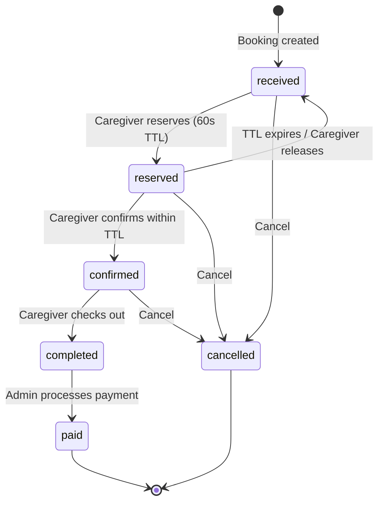
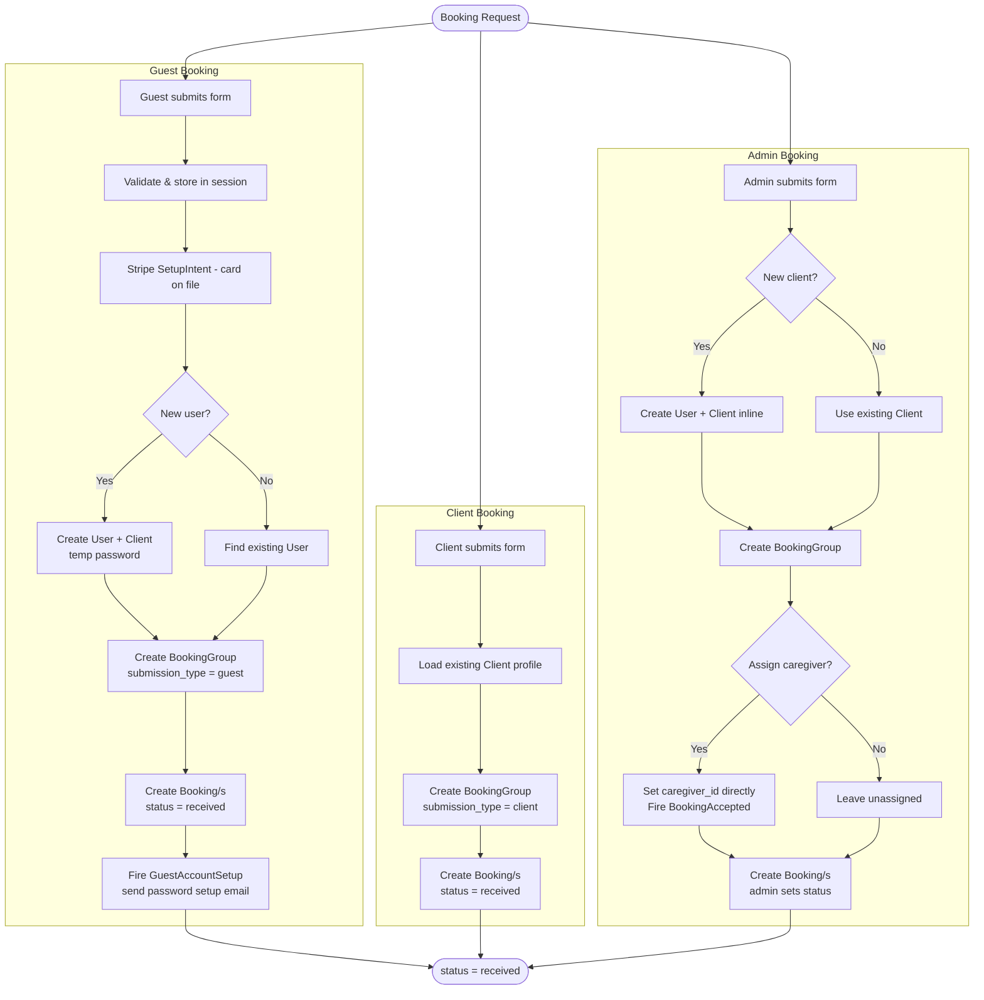
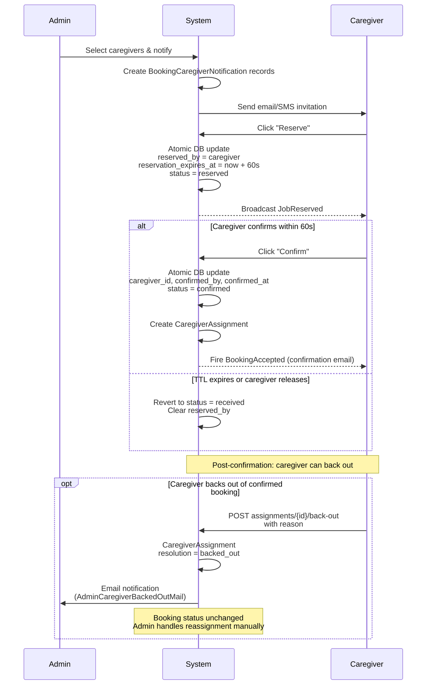
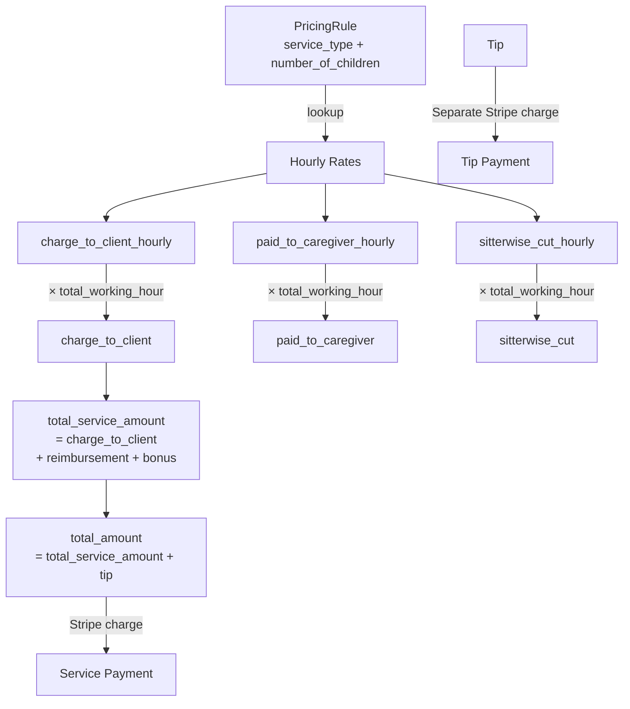
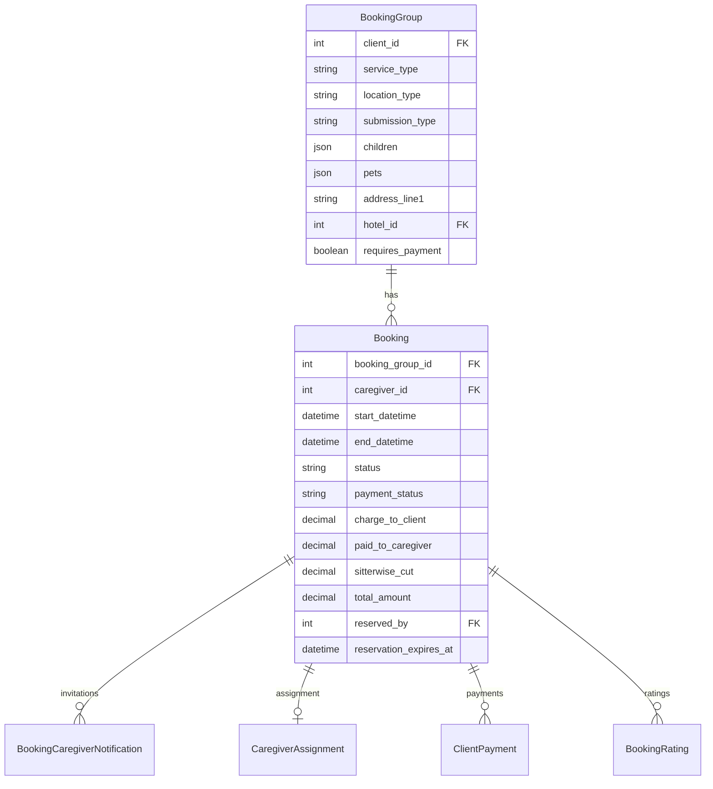
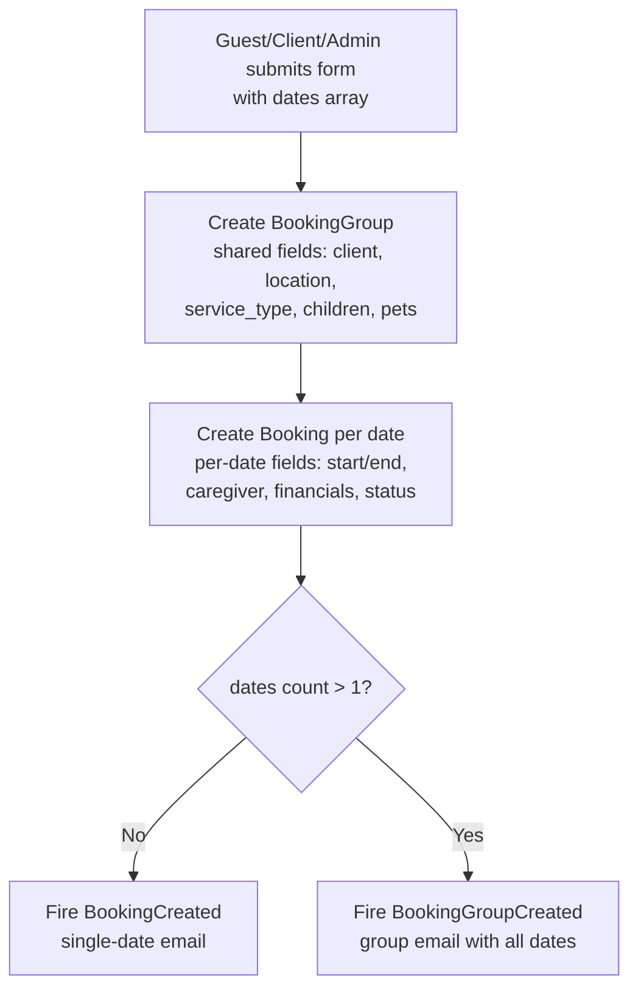
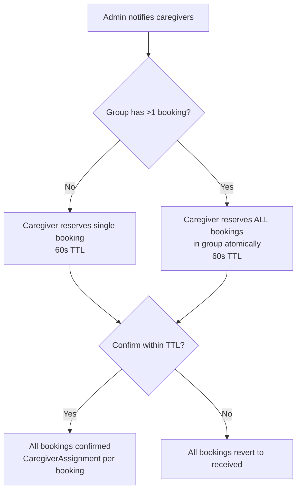
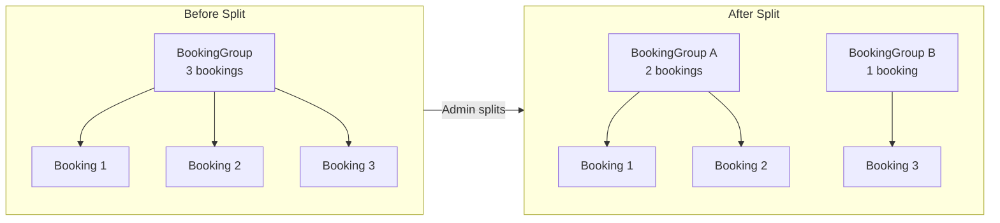
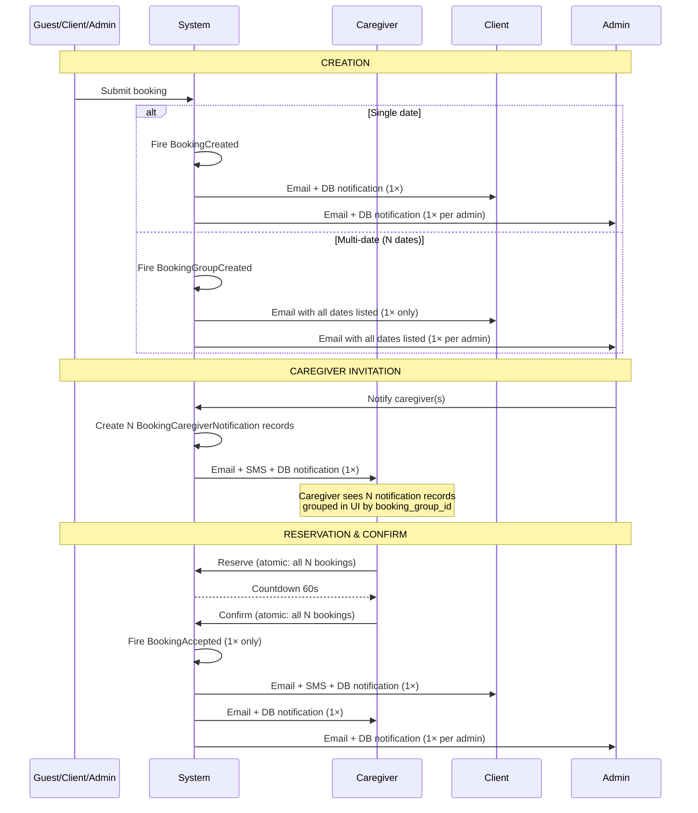

# Booking Flow

## Status Lifecycle



## Creation Channels



## Caregiver Assignment



## Post-Confirmation Lifecycle

```mermaid
flowchart TD
    subgraph Checkout["Caregiver Checkout"]
        direction TB
        CO1[Caregiver submits checkout] --> CO2[Update actual times<br/>reimbursement, bonus]
        CO2 --> CO3[status = completed<br/>checkout_at set]
    end

    subgraph Payment["Admin Payment"]
        direction TB
        P1[Admin reviews & adjusts] --> P2[Process Payment]
        P2 --> P3[Stripe PaymentIntent<br/>off-session charge]
        P3 --> P4{Success?}
        P4 -->|Yes| P5[status = paid<br/>payment_status = charged<br/>Send receipt email]
        P4 -->|No| P6[Increment charge_attempt_count<br/>payment_status = failed]
        P6 --> P7[Auto-retry queue<br/>0s → 1h → 1d → 3d<br/>max 4 attempts]
    end

    subgraph Rating["Rating"]
        direction TB
        R1[Client rates caregiver] --> R2[Update aggregate rating]
        R3[Caregiver rates client] --> R4[Update aggregate rating]
    end

    subgraph Cancellation["Admin Cancellation"]
        direction TB
        CA1[Admin clicks Cancel Booking<br/>with reason] --> CA2[POST /bookings/{booking}/cancel]
        CA2 --> CA3[status = cancelled<br/>cancelled_at, reason, cancelled_by]
        CA3 --> CA4[Zero all financial amounts]
        CA4 --> CA5[Resolve unresolved assignment<br/>to CancelledBySitterwise]
    end

    subgraph BackOut["Caregiver Back-Out"]
        direction TB
        BO1[Caregiver submits back-out<br/>with reason] --> BO2[POST /assignments/{id}/back-out]
        BO2 --> BO3[CaregiverAssignment<br/>resolved = backed_out]
        BO3 --> BO4[Admin notified via email]
        BO4 --> BO5[Booking status & caregiver_id<br/>unchanged — Admin handles manually]
    end

    CO3 --> P1
    P5 --> R1
    P5 --> R3
    CO3 --> BO1
```

> **Known gaps:** See `docs/caregiver-backout-gaps.md` for issues with the booking detail page, auto-resolve on reassign, replace caregiver flow, and other gaps in the backout/cancellation flow.

## Financial Model



## Data Model



## Group Booking

A single multi-date request creates one **BookingGroup** (header with shared fields) containing multiple **Bookings** (one per date/time slot). The `HasGroupFields` trait on `Booking` transparently delegates reads of shared fields (`service_type`, `children`, `pets`, `address`, etc.) to the parent group.

### Creation



### Caregiver Assignment (All-or-Nothing)



### Splitting

Admin can split a group — move some bookings to a new `BookingGroup`. After splitting, each sub-group operates independently (separate caregiver assignments, separate lifecycle).



### Payment

Payment is **per-booking**, not per-group. Each booking is charged independently via `JobBillingService::charge()`. A group is fully paid when all its child bookings reach `status = paid`.

## Notifications

Each booking lifecycle event triggers notifications to specific recipients via configured channels.



### Notification Events

For a group with **N dates**, `BookingInvitationSent` creates **N separate `BookingCaregiverNotification` records** (one per booking row). All other events fire **once** regardless of date count.

| Event | Trigger | Fires | Recipients | Channels | Notes |
|---|---|---|---|---|---|
| `BookingCreated` | Single booking created | 1× per booking | Client, all admins | `database`, `mail` | Uses `BookingCreatedNotification` (SendGrid template) |
| `BookingGroupCreated` | Multi-date group created | 1× per group | Client, all admins | `mail` only | Uses `ClientGroupBookingCreatedMail` / `AdminGroupBookingCreatedMail` — lists all dates |
| `BookingInvitationSent` | Admin notifies caregiver(s) | 1× per caregiver | That caregiver | `database`, `mail`, SMS | Creates N `BookingCaregiverNotification` rows (one per booking date) |
| `BookingAccepted` | Caregiver confirms | 1× per confirm action | Client, caregiver, all admins | `database`, `mail` (+ SMS for client) | Fires once from `CaregiverBookingService::confirm()` — all recipients notified simultaneously |

### Notification Channels by Recipient

| Channel | Client | Caregiver | Admin |
|---|---|---|---|
| `database` (in-app) | ✓ | ✓ | ✓ |
| `mail` (SendGrid) | ✓ | ✓ | ✓ |
| `Sms` (Twilio) | ✓ | ✗ | ✗ |

### Environment Guards

In non-production environments, notifications are guarded to prevent accidental delivery to real recipients:

- **Mail:** If `config('mail.default')` is a deliverable driver (`sendgrid`, `ses`, `postmark`, `mailgun`, `resend`), it is overridden to `log`.
- **SMS:** The `TwilioService` is replaced with a dry-run implementation that logs to the application log instead of sending via Twilio API.

See `AppServiceProvider::guardMailInNonProduction()` and `AppServiceProvider::guardSmsInNonProduction()`. Both methods are no-ops in production.
