# Booking Flow

## Status Lifecycle

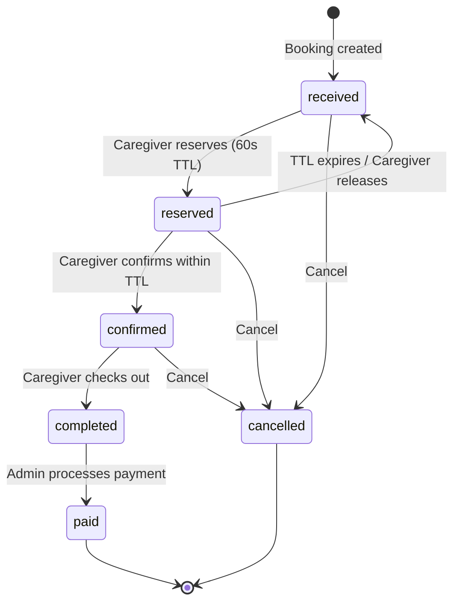

## Creation Channels


## Caregiver Assignment

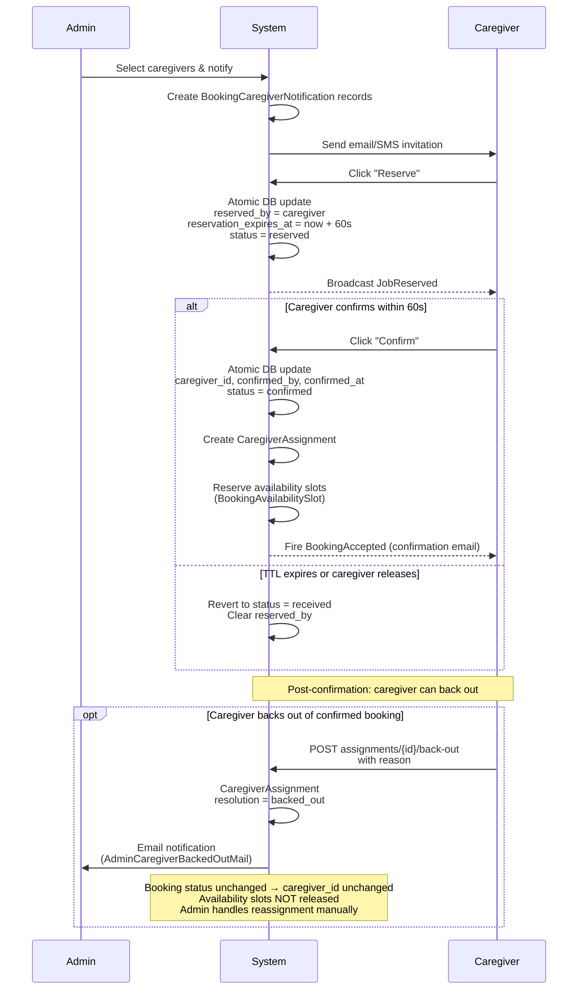

**Admin assignment** (no caregiver self-service): Admin sets `caregiver_id` directly on the booking → `Booking::saved` hook fires → `AvailabilityReservationService::reserve()` is called automatically.

**Unassign / Cancel:** Setting `caregiver_id = null` or `status = cancelled` → saved hook fires `AvailabilityReservationService::release()` → all `BookingAvailabilitySlot` records for that booking are deleted.

## Recommendation Pipeline

Before a caregiver is ever notified or assigned, the system scores and ranks all eligible caregivers. This happens in `CaregiverRecommendationService::getRecommendedCaregivers()`.

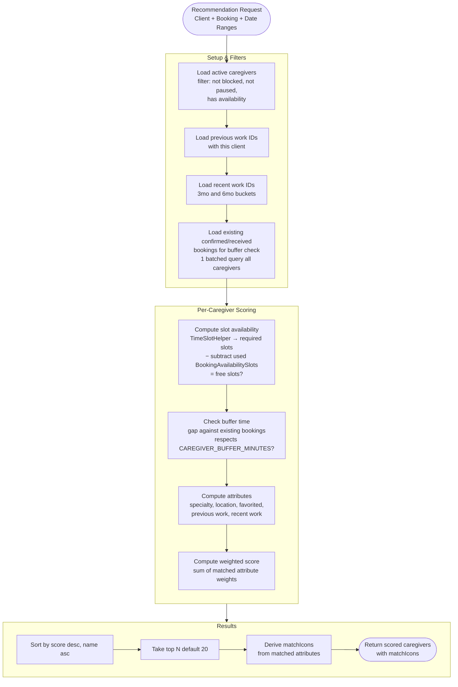

### Score Weights

Each criterion has a numeric weight. A caregiver's **score** = sum of weights for all matched criteria. Weights are designed so no combination of lower-priority criteria can outrank a higher-priority one.

| Priority | Criteria | Weight | Notes |
|---|---|---|---|
| 1 | Available + Favorited (bonus) | 100000 | Requires both — always outranks everything else |
| 2 | Available | 10000 | Slot check + buffer check both pass |
| 3 | Specialty match | 1000 | Matches service type age-group or sitter preference |
| 4 | Preferred location | 100 | Booking area is caregiver's preferred location |
| 5 | Willing location | 10 | Booking area is caregiver's non-preferred location |
| 6 | Recent work (3mo) | 3 | Completed work for any client in last 3 months |
| 7 | Previous work with client | 2 | Worked for this specific client before |
| 8 | Recent work (6mo) | 1 | Completed work for any client in last 6 months |

Score calculation:
```
score =
    (available && isFavorited ? 100000 : 0)
    + (available ? 10000 : 0)
    + (specialty ? 1000 : 0)
    + (preferredLocation ? 100 : 0)
    + (willingLocation ? 10 : 0)
    + (recentWork3mo ? 3 : 0)
    + (previousWork ? 2 : 0)
    + (recentWork6mo ? 1 : 0)
```

### Match Icons

Derived directly from matched attributes (not from score range). The frontend displays these icons to give transparency into why each caregiver was ranked how they were:

| Icon | Attribute | Shown when |
|---|---|---|
| `favorited` | Favorited by client | Caregiver is in client's favorites |
| `available` | Available | Slot check + buffer check both pass |
| `specialty` | Specialty match | Matches service type age-group or sitter preference (EAV) |
| `location_preferred` | Preferred location | Booking area is caregiver's preferred location |
| `location_willing` | Willing location | Booking area is caregiver's non-preferred location |
| `recent_work` | Recent work | Any work in last 6 months |
| `previous_work` | Previous work | Worked for this specific client before |

## Post-Confirmation Lifecycle

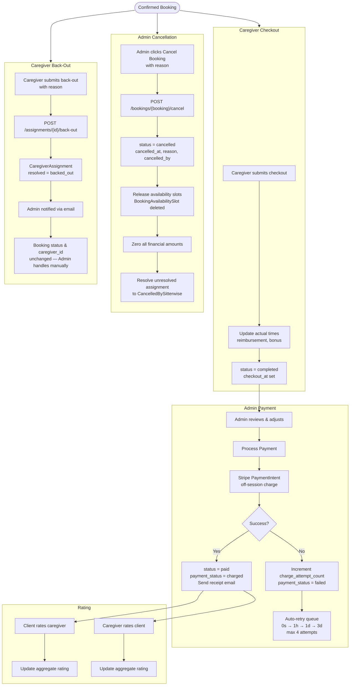

> **Known gaps:** See `docs/caregiver-backout-gaps.md` for issues with the booking detail page, auto-resolve on reassign, replace caregiver flow, and other gaps in the backout/cancellation flow.

## Financial Model

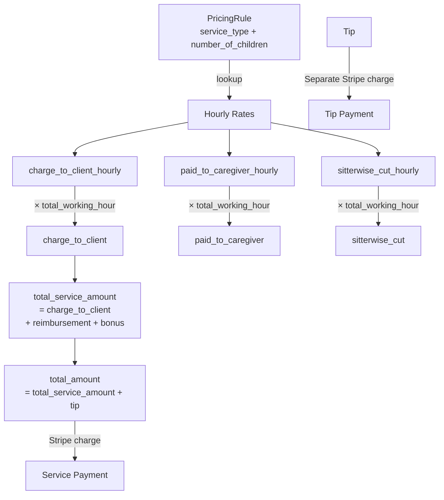

## Data Model

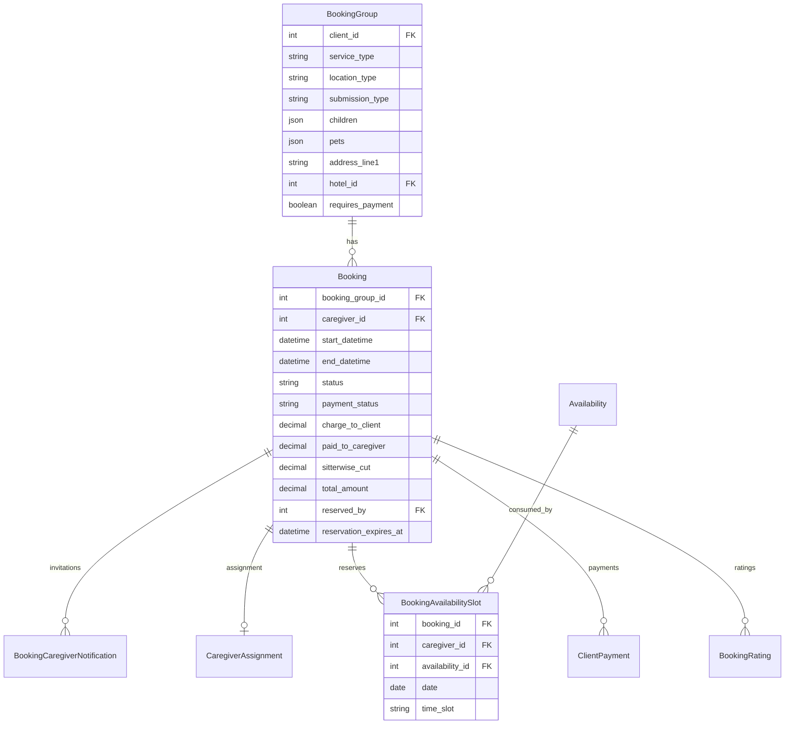

## Group Booking

A single multi-date request creates one **BookingGroup** (header with shared fields) containing multiple **Bookings** (one per date/time slot). The `HasGroupFields` trait on `Booking` transparently delegates reads of shared fields (`service_type`, `children`, `pets`, `address`, etc.) to the parent group.

### Creation

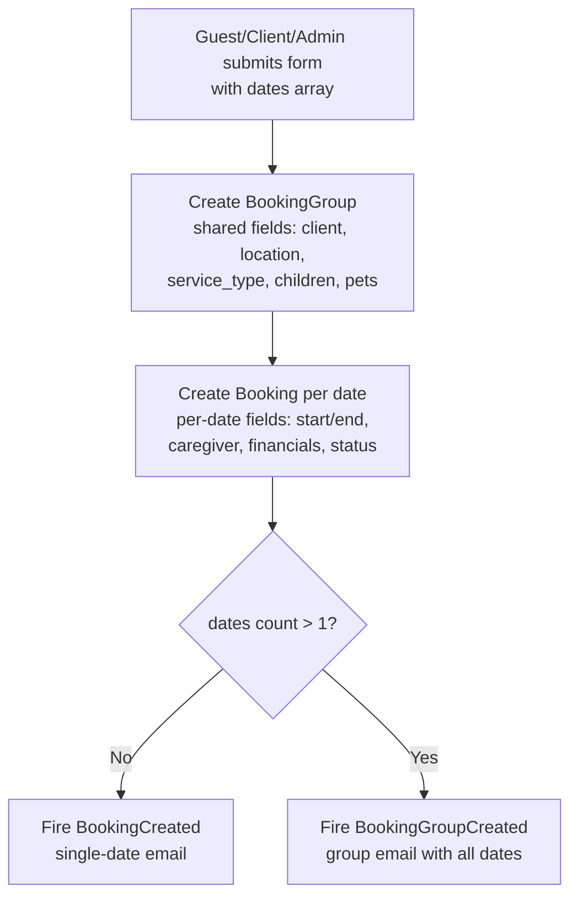

### Caregiver Assignment (All-or-Nothing)

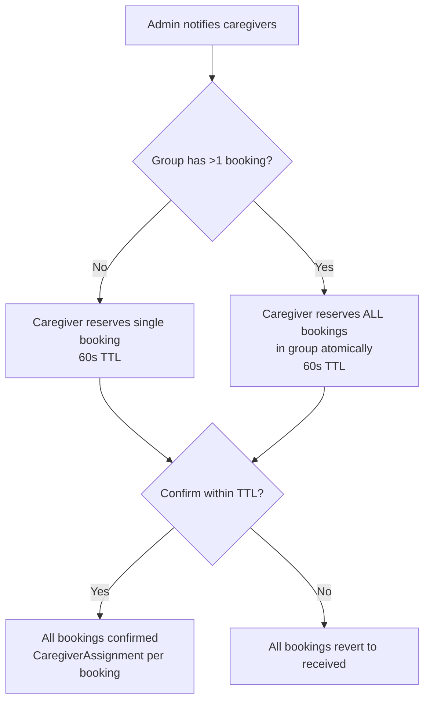

### Splitting

Admin can split a group — move some bookings to a new `BookingGroup`. After splitting, each sub-group operates independently (separate caregiver assignments, separate lifecycle).

Extracted bookings have their `caregiver_id` reset to null. `AdminBookingService::splitGroup()` explicitly calls `AvailabilityReservationService::release()` for each extracted booking (the raw DB update bypasses Eloquent events).

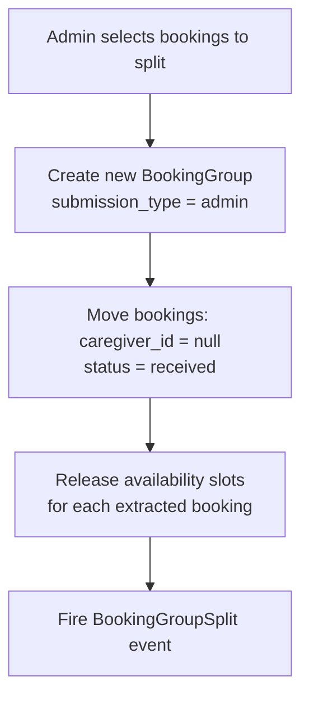

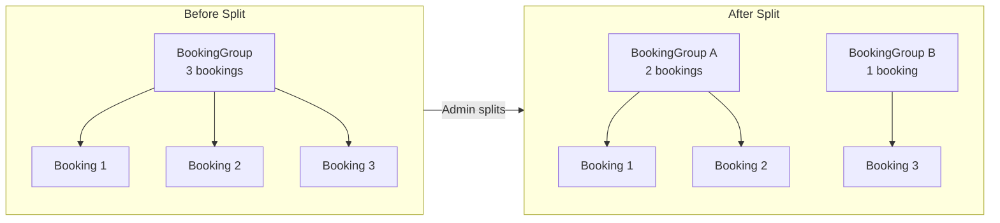

### Payment

Payment is **per-booking**, not per-group. Each booking is charged independently via `JobBillingService::charge()`. A group is fully paid when all its child bookings reach `status = paid`.

### Splitting & Availability

When a group is split, extracted bookings lose their `caregiver_id`. `AdminBookingService::splitGroup()` calls `AvailabilityReservationService::release()` for each extracted booking after the raw DB update (which bypasses Eloquent events).

## Half-Day Slot Mapping

The system divides each day into three half-day blocks (`TimeSlotHelper`). Bookings map to one or more blocks based on their time range:

| Slot | Time Range | Example booking | Required slots |
|---|---|---|---|
| Morning | 06:00 – 12:00 | 8:00 AM – 10:00 AM | `[morning]` |
| Afternoon | 12:00 – 18:00 | 1:00 PM – 3:00 PM | `[afternoon]` |
| Evening | 18:00 – 23:00 | 7:00 PM – 9:00 PM | `[evening]` |
| Cross-slot | — | 11:00 AM – 5:00 PM | `[morning, afternoon]` |
| Full day | — | 8:00 AM – 10:00 PM | `[morning, afternoon, evening]` |

### How overlapping works

A booking overlaps a slot if its time range has any intersection with the slot's window:

```
overlap if: bookingStart < slotEnd AND bookingEnd > slotStart
```

This means a booking ending at **18:00:00** does NOT overlap evening (18:00 > 18:00 = false), but a booking ending at **18:00:01** does overlap evening.

### Used slot subtraction

When checking availability, the system:
1. Determines required slots for the new booking
2. Loads the caregiver's `Availability.time_slots` for that date
3. Loads `BookingAvailabilitySlot` records (used slots) for that date
4. Computes `freeSlots = time_slots - usedSlots`
5. Checks `coveredSlots = requiredSlots ∩ freeSlots`
6. If `coveredSlots < requiredSlots`, caregiver is not available

## Calendar Visual States

The availability calendar (admin & caregiver dashboard) shows three visual states:

| State | Appearance | Meaning |
|---|---|---|
| **Available** | Colored icons (yellow Sunrise, teal Sun, blue Moon) | Caregiver set this slot, no booking conflict |
| **Booked** | Same icons, muted/gray (`opacity-30`) | Slot is set but occupied by a confirmed/received booking |
| **Not set** | Blank (—) | Caregiver never set availability for this date |

### Backend data flow

Each availability record includes a `booked_slots` array computed from the `usedSlots` relationship:

```
Availability
  ├─ time_slots: ['morning', 'afternoon', 'evening']   (what caregiver set)
  └─ booked_slots: ['morning']                           (what a booking consumes)
      → frontend renders: morning = gray, afternoon = colored, evening = colored
```

### Date clickability

- **Fully booked** (all `time_slots` are in `booked_slots`): date is NOT clickable — no "Add"/"Edit" overlay, `cursor-default`.
- **Partially booked**: date remains clickable — only free slots are editable.
- **No availability set**: date is clickable — "Add" overlay appears.

## Notifications

Each booking lifecycle event triggers notifications to specific recipients via configured channels.

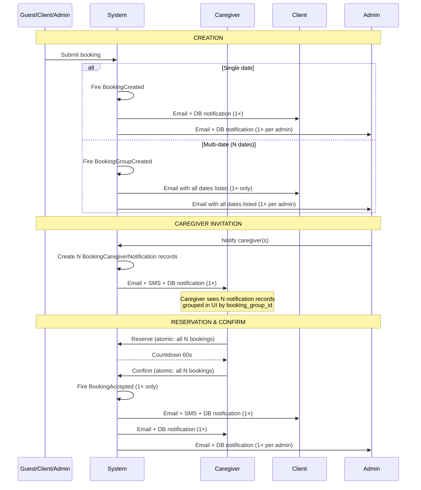

### Notification Events

For a group with **N dates**, `BookingInvitationSent` creates **N separate `BookingCaregiverNotification` records** (one per booking row). All other events fire **once** regardless of date count.

| Event | Trigger | Fires | Recipients | Channels | Notes |
|---|---|---|---|---|---|
| `BookingCreated` | Single booking created | 1× per booking | Client, all admins | `database`, `mail` | Uses `BookingCreatedNotification` (SendGrid template) |
| `BookingGroupCreated` | Multi-date group created | 1× per group | Client, all admins | `mail` only | Uses `ClientGroupBookingCreatedMail` / `AdminGroupBookingCreatedMail` — lists all dates |
| `BookingInvitationSent` | Admin notifies caregiver(s) | 1× per caregiver | That caregiver | `database`, `mail`, SMS | Creates N `BookingCaregiverNotification` rows (one per booking date) |
| `BookingAccepted` | Caregiver confirms | 1× per confirm action | Client, caregiver, all admins | `database`, `mail` (+ SMS for client) | Fires once from `CaregiverBookingService::confirm()` — all recipients notified simultaneously |

### Notification Channels by Recipient

| Channel | Client | Caregiver | Admin |
|---|---|---|---|
| `database` (in-app) | ✓ | ✓ | ✓ |
| `mail` (SendGrid) | ✓ | ✓ | ✓ |
| `Sms` (Twilio) | ✓ | ✗ | ✗ |

### Environment Guards

In non-production environments, notifications are guarded to prevent accidental delivery to real recipients:

- **Mail:** If `config('mail.default')` is a deliverable driver (`sendgrid`, `ses`, `postmark`, `mailgun`, `resend`), it is overridden to `log`.
- **SMS:** The `TwilioService` is replaced with a dry-run implementation that logs to the application log instead of sending via Twilio API.

See `AppServiceProvider::guardMailInNonProduction()` and `AppServiceProvider::guardSmsInNonProduction()`. Both methods are no-ops in production.
