# Guest Group Booking Implementation Plan

## Goal
Implement group booking: multi-date bookings with a `BookingGroup` header record (30 shared fields) + per-date `Booking` records. Allows guests, clients, and admins to submit multiple dates in a single form. Admin dashboard shows group context, emails are per-group (one email with all dates), and caregiver notification is per-group (all-or-nothing).

---

## Current State

### ✅ Completed
- Schema: BookingGroup table (30 shared fields), Bookings table (per-date fields only)
- Models: BookingGroup, Booking (HasGroupFields trait, scopeSearchGroupFields, client proxy), Client (bookingGroups, bookings via hasManyThrough)
- Services: Guest/Client/Admin all create BookingGroup + N Bookings, fire correct event
- Events/Mail: BookingGroupCreated, SendBookingGroupCreatedNotifications listener, Blade templates (replacing SendGrid) for both client + admin group emails
- Import command: per-job BookingGroup + Booking creation
- SearchController: uses scopeSearchGroupFields
- CaregiverRecommendationService: uses whereHas('bookingGroup')
- Guest booking create: multi-date form with dates[] array
- Guest booking confirmation: redesigned dates panel (Date | Time, no status, matching info panel style)
- Client booking create: multi-date support
- Caregiver bookings index: grouped card display
- Admin booking show: compact `[Group (N)]` badge + sibling dates with left-border indent
- Admin booking-sheet: group context panel
- **Gap A** — Admin Split: BookingGroupSplit event, splitGroup() backend, route, controller, frontend dialog (admin show + booking-sheet), 6 tests
- **Gap B** — Atomic Caregiver Ops: isGroupBooking() helper, reserve/confirm/release refactored to lock+update all siblings in transaction, broadcasts per-sibling (Option A), 3 tests
- **Gap C** — Admin Index Group Badge: bookings_count eager-loaded, calendar view Users icon below service icon, table view `[Group]` badge inline after client name
- **Gap D** — Client + Caregiver Show/Index: group context, dark mode, all hardcoded colors removed
- 58 relevant tests pass (BookingGroup, BookingCreated, SendBookingGroup, split group, Booking - Caregiver)

### 🔲 No remaining gaps — group booking implementation complete

---

## Key Design Decisions

1. **`is_split` removed** — splitting is a physical move: create a new `BookingGroup` and reassign the booking's `booking_group_id`. No flag needed. Dropped from the schema entirely since there's no production data.
2. **One email per group** — fire `BookingGroupCreated` event once, send one email listing all dates. Recipient immediately sees it's a group booking.
3. **Booking ULID as URL entry point** — no new URL scheme. `/bookings/{id}` loads single booking detail + loads group context via `bookingGroup` relationship. The page shows "Part of group (N dates)" with sibling links.
4. **All-or-nothing caregiver** — when unsplit, reserving/confirming one booking reserves/confirms all in the group. Split creates a new group; both groups become independent.
5. **Strict normalization** — `client_id` removed from `bookings`. Access via `$booking->bookingGroup->client_id`.
6. **Group booking emails use Blade templates, not SendGrid** — switched from SendGrid dynamic templates to `resources/views/emails/client-group-booking-created.blade.php` and `admin-group-booking-created.blade.php`, matching confirmation page layout with Date | Time table.
7. **Dark-mode compatible UIs** — avoid hardcoded blue backgrounds. Use `bg-muted`, `border-border`, `Badge variant="outline"` for group indicators. No hardcoded color values.
8. **Compact layouts** — admin show uses inline `[Group (N)]` badge + `border-l-2 border-border` indent for sibling dates rather than a separate blue panel.
9. **Guest confirmation dates panel** — styled like info panel (`rounded-lg bg-muted p-4`), Date | Time columns, same font color for both, no status column.
10. **Split edge cases** — extracted bookings reset to `received` with caregiver fields cleared; `lockForUpdate()` inside transaction prevents races; always redirect to first extracted booking; `BookingGroupSplit` event fired; paid bookings can be split (payment fields are per-booking).
11. **Atomic caregiver Ops (Gap B)** — `isGroupBooking()` checks `bookings()->count() > 1`; group paths use `DB::transaction()` with `lockForUpdate()` on all siblings; broadcasts fire per-sibling (Option A, no new events); all sibling notifications marked claimed on group confirm.
12. **Admin index group badge (Gap C)** — calendar view: `Users` icon stacked below service icon when group; table view: `[Group]` badge inline after client name; no separate column needed.

---

## Architecture

```mermaid
flowchart TB
    subgraph Guest["Guest Flow"]
        A["Guest submits form<br/>(1 date or N dates)"] --> B["validateOnly stores in session"]
        B --> C["Stripe Checkout Session"]
        C --> D["createBookingWithPayment"]
    end

    subgraph Storage["Normalized Storage"]
        D --> E["BookingGroup (header)<br/>shared fields on group"]
        E --> F["Booking(s):<br/>1 line item per date"]
    end

    subgraph Decision["Service decides the event"]
        F --> G{"count($dates) > 1?"}
        G -- "No (single date)" --> H["BookingCreated($booking)<br/>(existing, unchanged)"]
        G -- "Yes (multi-date)" --> I["BookingGroupCreated($bookingGroup)<br/>(new, fires once)"]
    end

    subgraph SinglePath["Single-Date Path"]
        H --> J["SendBookingCreatedNotifications<br/>(existing listener)"]
        J --> K["ClientBookingCreatedMail<br/>(one date, one email)"]
        J --> L["AdminBookingCreatedMail"]
    end

    subgraph GroupPath["Multi-Date Path"]
        I --> M["SendBookingGroupCreatedNotifications<br/>(new listener)"]
        M --> N["ClientGroupBookingCreatedMail<br/>(all dates, one email)"]
        M --> O["AdminGroupBookingCreatedMail"]
    end

    subgraph AdminView["Admin Visibility"]
        K --> P["Index: single row"]
        L --> P
        N --> P
        O --> P
        P --> Q["Detail page loads<br/>bookingGroup context"]
        Q --> R["Shows sibling dates<br/>if group has >1 booking"]
    end

    subgraph CaregiverLifecycle["Caregiver Lifecycle"]
        R --> S["status: received"]
        S --> T["Admin notifies caregivers<br/>(BookingCaregiverNotification)"]
        T --> U{"group has >1<br/>unsplit siblings?"}
        U -- "No" --> V["Caregiver reserves<br/>(60s TTL, single booking)"]
        U -- "Yes" --> W["Caregiver reserves ALL<br/>(lockForUpdate + atomic, 60s TTL)"]
        V --> X["60s TTL expires"]
        W --> X
        X --> Y["status: back to received<br/>(auto-cleanup command)"]
        Y --> C1{"Admin needs to<br/>split group?"}
        C1 -- "Yes" --> C2["lockForUpdate extracted<br/>BookingGroup::replicate()"]
        C2 --> C3["Reset to received<br/>Clear caregiver fields"]
        C3 --> C4["BookingGroupSplit event<br/>Redirect to first booking"]
        C4 --> S
        C1 -- "No" --> S
        V --> Z["Caregiver confirms<br/>(atomic for group)"]
        W --> Z
        Z --> AA["status: confirmed<br/>CaregiverAssignment created"]
        AA --> AB{"Admin needs to<br/>split group?"}
        AB -- "Yes" --> AC["lockForUpdate extracted<br/>BookingGroup::replicate()"]
        AC --> AD["Reset to received<br/>Clear caregiver fields"]
        AD --> AE["BookingGroupSplit event<br/>Redirect to first booking"]
        AE --> AF["Each sub-group<br/>continues independently<br/>new group: fresh status<br/>old group: retains confirmed dates"]
        AB -- "No" --> AF
        AF --> AG["Caregiver checks out<br/>(per-date, different end times)"]
        AG --> AH["status: completed<br/>Assignment resolved"]
    end

    subgraph Payment["Payment"]
        AH --> AI["Admin processes payment<br/>(per-booking)"]
        AI --> AJ{"requires_payment<br/>= true?"}
        AJ -- "No (comped)" --> AK["status: paid<br/>skipped charge"]
        AJ -- "Yes" --> AL["JobBillingService::charge()<br/>one PI per booking"]
        AL --> AM{"Charge succeeds?"}
        AM -- "Yes" --> AN["status: paid<br/>payment_status: charged<br/>BookingReceipt event"]
        AM -- "No" --> AO["payment_status: failed<br/>charge_attempt_count++<br/>PaymentFailureHandler"]
        AO --> AP["Retry with backoff<br/>(1h, 1d, 3d, then permanent)"]
        AP --> AL
        AK --> AQ["All bookings in group paid?"]
        AN --> AQ
AQ -- "No" --> AG
AQ -- "Yes" --> AR["All siblings paid<br/>(BookingGroupFullyPaid if per-group)"]
    end

    AR --> AS["Tip + Review<br/>(TBD: per-booking or per-group)"]
```



## Database Schema

```mermaid
erDiagram
    booking_groups ||--o{ bookings : contains
    booking_groups }o--|| clients : belongs_to

    booking_groups {
        bigint id PK
        bigint client_id FK "normalized from bookings"
        timestamp submitted_at
        varchar submission_type "guest | logged_in | admin | import"
        varchar service_type "normalized from bookings"
        varchar location_type "normalized from bookings"
        varchar rental_platform "nullable"
        varchar client_first_name
        varchar client_last_name
        varchar client_phone
        varchar client_email
        bigint address_id FK "nullable"
        varchar address_line1 "nullable"
        varchar address_line2 "nullable"
        varchar address_city "nullable"
        varchar address_state "nullable"
        varchar address_zip "nullable"
        bigint hotel_id FK "nullable"
        varchar hotel_name "nullable"
        json children "snapshot"
        json pets "snapshot"
        text children_notes "nullable"
        json sitter_preferences "nullable"
        varchar other_adults_present "nullable"
        text special_needs_notes "nullable"
        text emergency_instructions "nullable"
        varchar how_did_you_hear "nullable"
        text caregiver_notes "nullable"
        text notes_to_sitterwise "nullable"
        text admin_notes "nullable"
        varchar corporate_id "nullable"
        boolean requires_payment "default true"
        json special_considerations "computed from prefs + pets + adults"
        softDeletes
        timestamps
    }

    bookings {
        bigint id PK
        char ulid
        bigint booking_group_id FK "links to header"
        bigint caregiver_id FK "nullable"
        bigint availability_id FK "nullable"
        bigint pricing_rule_id FK "nullable"
        datetime start_datetime
        datetime end_datetime
        datetime checkout_at "nullable"
        decimal total_working_hour
        varchar status
        bigint reserved_by FK "nullable"
        datetime reservation_expires_at "nullable"
        bigint confirmed_by FK "nullable"
        datetime confirmed_at "nullable"
        decimal charge_to_client_hourly
        decimal paid_to_caregiver_hourly
        decimal sitterwise_cut_hourly
        decimal charge_to_client
        decimal paid_to_caregiver
        decimal sitterwise_cut
        decimal reimbursement "default 0"
        varchar reimbursement_description "nullable"
        decimal bonus "default 0"
        decimal tip "default 0"
        decimal hotel_fee "default 0"
        decimal paid_to_caregiver_total "nullable"
        decimal total_service_amount
        decimal total_amount
        decimal actual_amount "nullable"
        varchar payment_status
        varchar stripe_payment_intent_id "nullable"
        int charge_attempt_count "default 0"
        datetime last_charge_attempt_at "nullable"
        varchar bubble_id "nullable, indexed"
        datetime cancelled_at "nullable"
        text cancellation_reason "nullable"
        bigint cancelled_by_id FK "nullable"
        softDeletes
        timestamps
    }
```



### Columns Removed from `bookings` (30 total)

`client_id`, `service_type`, `location_type`, `rental_platform`, `client_first_name`, `client_last_name`, `client_phone`, `client_email`, `address_id`, `address_line1`, `address_line2`, `address_city`, `address_state`, `address_zip`, `hotel_id`, `hotel_name`, `children`, `pets`, `children_notes`, `sitter_preferences`, `other_adults_present`, `special_needs_notes`, `emergency_instructions`, `how_did_you_hear`, `caregiver_notes`, `notes_to_sitterwise`, `admin_notes`, `corporate_id`, `requires_payment`, `special_considerations`.

---

## Phase 1: Schema Changes

No new migration files. Since there is no production data, edit the existing migration files in-place:

### `database/migrations/2026_04_01_041855_create_booking_groups_table.php`

- Add 30 shared columns: `service_type`, `location_type`, `rental_platform`, `client_first_name`, `client_last_name`, `client_phone`, `client_email`, `address_id` (FK), `address_line1`, `address_line2`, `address_city`, `address_state`, `address_zip`, `hotel_id` (FK), `hotel_name`, `children` (json), `pets` (json), `children_notes`, `sitter_preferences` (json), `other_adults_present`, `special_needs_notes`, `emergency_instructions`, `how_did_you_hear`, `caregiver_notes`, `notes_to_sitterwise`, `admin_notes`, `corporate_id`, `requires_payment` (boolean, default true), `special_considerations` (json)

- Remove `is_split` column

### `database/migrations/2026_04_01_041859_create_bookings_table.php`

- Remove FKs: `client_id`, `hotel_id`, `address_id`
- Remove 30 columns (see list above)
- Keep per-date fields: `caregiver_id`, `availability_id`, `pricing_rule_id`, `start_datetime`, `end_datetime`, `checkout_at`, `total_working_hour`, `status`, `reserved_by`, `reservation_expires_at`, `confirmed_by`, `confirmed_at`, `charge_to_client_hourly`, `paid_to_caregiver_hourly`, `sitterwise_cut_hourly`, `charge_to_client`, `paid_to_caregiver`, `sitterwise_cut`, `reimbursement`, `reimbursement_description`, `bonus`, `tip`, `hotel_fee`, `paid_to_caregiver_total`, `total_service_amount`, `total_amount`, `payment_status`, `stripe_payment_intent_id`, `actual_amount`, `charge_attempt_count`, `last_charge_attempt_at`, `bubble_id`, `cancelled_at`, `cancellation_reason`, `cancelled_by_id`

### Why no backfill

There is no production data. After the migration files are edited, run `php artisan migrate:fresh` to rebuild both tables with the correct schema. Then re-import from Bubble to populate the new structure.

---

## Phase 2: Backend Code Changes

### 2.1 Model Layer

#### `app/Models/BookingGroup.php`

Add 30 fillable fields, casts (arrays, enums, booleans), relationships (`hotel()`, `address()`), `calculateSpecialConsiderations()` (moved from Booking), `toEmailData()` that enumerates sibling dates.

#### `app/Models/Booking.php`

- Remove 30 casts for fields moved to group
- Remove `client()` relationship entirely. Access via `$booking->bookingGroup->client`. A convenience proxy method can be added to `Booking` but it must NOT be an Eloquent relationship — return `?Client` directly:
  ```php
  public function client(): ?Client
  {
      return $this->bookingGroup?->client;
  }
  ```
  This prevents the method from being used in query builder chains (which should go through `bookingGroup` anyway).
- Refactor boot events:
  - `calculateTotalWorkingHours()` stays (only depends on start/end)
  - `calculateHourlyRate()` removed from boot (depends on `service_type`/`children`/`pets` — now on group; move to service layer)
  - `calculateTotalAmount()` stays (depends on per-date pricing fields)
  - `calculateSpecialConsiderations()` removed from boot (moved to BookingGroup)
- Add a `HasGroupFields` trait with explicit accessors for commonly-delegated fields (not a magic `getAttribute()` override, which breaks `isDirty()`/`toArray()`/`fill()`):
  ```php
  /**
   * These accessors delegate to bookingGroup for in-memory reads.
   *
   * NOTE: isDirty() checks Booking's own attributes array, NOT the group's.
   * To detect group-level changes, use $booking->bookingGroup->isDirty('children').
   * The BookingGroupObserver handles auto-repricing when group fields change.
   */
  trait HasGroupFields
  {
      public function getServiceTypeAttribute(): ?string
      {
          return $this->bookingGroup?->service_type;
      }

      public function getChildrenAttribute(): array
      {
          return $this->bookingGroup?->children ?? [];
      }

      public function getPetsAttribute(): array
      {
          return $this->bookingGroup?->pets ?? [];
      }

      // ... other commonly-accessed fields
  }
  ```
  This is explicit about which fields are delegated, grep-able, and doesn't interfere with Eloquent internals.
- Update `toEmailData()` to read shared fields from `bookingGroup`

#### `app/Models/Client.php`

- Add a `bookingGroups()` relationship (`HasMany`) for direct group queries:
  ```php
  public function bookingGroups(): HasMany
  {
      return $this->hasMany(BookingGroup::class);
  }
  ```
- Change `bookings()` from `hasMany(Booking::class)` to `hasManyThrough(Booking::class, BookingGroup::class)`:
  ```php
  public function bookings(): HasManyThrough
  {
      return $this->hasManyThrough(Booking::class, BookingGroup::class);
  }
  ```
- Rewrite `previousCaregivers()` to join through `booking_groups` instead of using `bookings.client_id`

### 2.2 Service Layer

All three services (Guest, Client, Admin) follow the same pattern:
1. Move shared fields (30 columns) into `BookingGroup::create()`
2. Keep only per-date fields in `Booking::create()`
3. Call `$bookingGroup->calculateSpecialConsiderations()` after setting prefs/pets/adults
4. Calculate pricing rule explicitly in the service (was in boot), set `charge_to_client_hourly` etc. on each booking
5. Fire the correct event based on how many dates were submitted

**Event decision logic — service decides, not the listener.**
When `BookingCreated` fires for the first booking in a multi-date group, the sibling bookings don't exist yet. The listener can't count siblings to choose the right notification. The service knows the intent (single vs multi), so it picks the event:

| Submission type | Event to fire |
|---|---|
| Single date | `BookingCreated($booking)` — existing flow, unchanged |
| Multiple dates | `BookingGroupCreated($bookingGroup)` — new, one event for all |

```php
// In the service, after creating all bookings for the group:
if (count($dates) > 1) {
    event(new BookingGroupCreated($bookingGroup));
} else {
    event(new BookingCreated($booking));
}
```

Ownership checks change:
- Before: `$booking->client_id !== $client->id`
- After: `$booking->bookingGroup->client_id !== $client->id`

Eager loading refactor:
- Replace direct `'hotel'` and `'address'` with nested `'bookingGroup.hotel'` and `'bookingGroup.address'` (e.g. in `AdminBookingService::index()` and `::show()`)
- Replace direct `'client.user'` with `'bookingGroup.client.user'` where shared fields are needed
- Affected services: `AdminBookingService`, `ClientBookingService`, `CaregiverBookingService`, `Export`, `SearchController`
- **SearchController** — add a `scopeSearchGroupFields` on the Booking model and use it instead of a raw join:

```php
// In Booking model
public function scopeSearchGroupFields(Builder $query, string $search): Builder
{
    return $query->whereHas('bookingGroup', function ($q) use ($search) {
        $q->where('corporate_id', 'like', "%{$search}%")
          ->orWhere('address_line1', 'like', "%{$search}%")
          ->orWhere('address_city', 'like', "%{$search}%")
          ->orWhere('address_state', 'like', "%{$search}%")
          ->orWhere('address_zip', 'like', "%{$search}%");
    });
}

// In SearchController
$bookings = Booking::with(['bookingGroup.client', 'caregiver'])
    ->where(function ($q) use ($query) {
        $q->where('ulid', 'like', "%{$query}%")
          ->searchGroupFields($query);
    });
```

- **CaregiverRecommendationService** — replace `->where('client_id', $client->id)` with `->whereHas('bookingGroup', fn ($q) => $q->where('client_id', $client->id))`:

```php
// Old
Booking::where('caregiver_id', $caregiver->id)
    ->where('client_id', $client->id)

// New
Booking::where('caregiver_id', $caregiver->id)
    ->whereHas('bookingGroup', fn ($q) => $q->where('client_id', $client->id))
```

### 2.3 BookingGroup Observer — Hourly Rate Recalculation

When shared fields that affect pricing (`service_type`, `children`, `pets`) change on a BookingGroup, the child bookings must be repriced. This was previously handled by Booking's `updating` boot event — after normalization, the group owns those fields.

Add a `BookingGroupObserver` (or inline in `BookingGroup::boot()`):

```php
static::updating(function (BookingGroup $group) {
    if ($group->isDirty(['service_type', 'children', 'pets'])) {
        $group->loadMissing('bookings');

        foreach ($group->bookings as $booking) {
            $booking->calculateHourlyRate($group);
            $booking->calculateTotalAmount();
            $booking->saveQuietly();
        }
    }
});
```

Auto-repricing logs which booking IDs were updated so it's auditable. If auto-repricing is undesirable for the admin workflow, document that repricing must be triggered explicitly via a service method with an admin UI button.

### 2.4 Events / Mail / Notifications

**Existing (unchanged):**
- `BookingCreated($booking)` — fires for single-date submissions only
- `SendBookingCreatedNotifications` listener still sends `ClientBookingCreatedMail` / `AdminBookingCreatedMail`
- Both existing mailers still accept a single `Booking`

**New (group flow):**
- `BookingGroupCreated($bookingGroup)` — fires once per multi-date group
- `SendBookingGroupCreatedNotifications` listener sends one client email + one admin email
- `ClientGroupBookingCreatedMail` and `AdminGroupBookingCreatedMail` accept `BookingGroup`, loop over sibling dates in SendGrid template
- URLs for notification entry points remain unchanged (use `booking.ulid`)

#### TBD: Tip + Receipt + Review — Per-Booking vs Per-Group

After the last booking in a group is paid, the client receives a receipt email with a review link. The tip and review flow has two options — **to be decided before Phase 2 implementation**.

**Per-Booking (minimal changes):**
- `BookingReceipt` fires after each sibling is charged → N emails per group
- Each email links to `/reviews/{booking}` for that specific date
- `TipChargeService::charge(Booking $booking, ...)` — one PI per booking
- `tip` field stays on `bookings` (per-date)
- `BookingRating` per-booking, unchanged
- Review UI unchanged

**Per-Group (better UX, more changes):**
- Need new event `BookingGroupFullyPaid` — fires once after last sibling in group is charged
  - Detect via Booking `saved` event: `$booking->wasChanged('status') && $booking->status === 'paid'` → check if all siblings are paid
- `BookingReceipt` suppressed for group bookings (only fires for single-date)
- `BookingGroupFullyPaid` sends one receipt email listing all dates with per-date review links
- `TipChargeService::charge(BookingGroup $group, ...)` — one PI for group total
- `tip` field moves to `booking_groups`
- `BookingRating` stays per-booking (each date may have a different caregiver)

| Aspect | Per-Booking | Per-Group |
|---|---|---|
| `tip` field | Stays on `bookings` | Moves to `booking_groups` |
| Receipt emails | N per group | 1 per group |
| Tip PIs | N per group | 1 per group |
| "Fully paid" detection | Not needed | New listener on `Booking::saved` |
| New events needed | None | `BookingGroupFullyPaid` |
| `TipChargeService::charge()` | Unchanged | New signature: `charge(BookingGroup, ...)` |
| Review pages | Unchanged (`/reviews/{booking}`) | Same (per-booking rating), but email links to all |
| Client UX | Separate tip + review per date | One tip, review each date separately |

**Decision:** TBD by client before Phase 2 implementation.

### 2.5 Admin Split

```php
$newGroup = BookingGroup::create([
    'client_id' => $originalGroup->client_id,
    'submitted_at' => now(),
    'submission_type' => 'admin',
    // ... copy shared fields
]);

Booking::whereIn('id', $extractedIds)->update([
    'booking_group_id' => $newGroup->id,
]);
```

### 2.6 Caregiver Service — Atomic Group Operations

Reserve, confirm, and release must be atomic across ALL dates in a group (all-or-nothing). Implement with `lockForUpdate()` to prevent race conditions.

**Logging:** When a transaction fails because a sibling is already reserved, log the specific conflicting booking IDs for debugging:

```php
DB::transaction(function () use ($booking, $caregiver) {
    $bookingsInGroup = Booking::where('booking_group_id', $booking->booking_group_id)
        ->whereNull('deleted_at')
        ->lockForUpdate()
        ->get();

    foreach ($bookingsInGroup as $item) {
        if ($item->status !== 'received') {
            logger()->warning('Group reservation conflict', [
                'group_id' => $booking->booking_group_id,
                'conflicting_booking' => $item->id,
                'conflicting_status' => $item->status,
                'attempting_caregiver' => $caregiver->id,
            ]);
            throw new \Exception('One or more days in this group are no longer available.');
        }
    }

    Booking::where('booking_group_id', $booking->booking_group_id)
        ->whereNull('deleted_at')
        ->update([
            'reserved_by' => $caregiver->id,
            'reservation_expires_at' => $expiresAt,
            'status' => 'reserved',
        ]);
});
```

**Group size limit:** Enforce a maximum of 14 dates per group at the validation layer to prevent pathological lock contention.

Apply the same pattern for `confirm()` and `release()` in `CaregiverBookingService.php`.

### 2.7 Import Command — `ImportBubbleDatabase`

The `importJob()` method currently lumps every Bubble job for a client into one `firstOrCreate` group. This is incorrect — each Bubble job represents a single booking submission and should be one `BookingGroup` with one child `Booking`.

**Current behavior:**
- `$bookingData` contains both shared fields and per-date fields
- Group is `firstOrCreate`'d by `submission_type` (lumps all jobs for a client together)
- `client_id` is set directly on the booking

**Required changes:**
1. Replace `firstOrCreate` with a per-job `BookingGroup::create()`
2. Extract shared fields into `$groupData` and pass to `BookingGroup::create()`
3. Remove shared fields + `client_id` from `$bookingData` — keep only per-date fields

**Structure after change — each Bubble job becomes:**
```
BookingGroup (1 per job, shared fields here)
  └── Booking (1 per job, per-date fields here)
```

**Shared fields to extract from `$bookingData` (→ `$groupData`):**
`client_id`, `service_type`, `location_type`, `address_line1`, `address_city`, `address_state`, `address_zip`, `hotel_id`, `hotel_name`, `client_first_name`, `client_last_name`, `client_email`, `client_phone`, `caregiver_notes`, `notes_to_sitterwise`, `admin_notes`, `requires_payment`, `children`, `children_notes`, `pets`, `special_considerations`

**Per-date fields that stay on `$bookingData`:**
`caregiver_id`, `bubble_id`, `confirmed_at`, `start_datetime`, `end_datetime`, `status`, `total_working_hour`, `charge_to_client_hourly`, `paid_to_caregiver_hourly`, `sitterwise_cut_hourly`, `charge_to_client`, `paid_to_caregiver`, `sitterwise_cut`, `tip`, `bonus`, `reimbursement`, `reimbursement_description`, `hotel_fee`, `paid_to_caregiver_total`, `total_service_amount`, `total_amount`, `payment_status`, `stripe_payment_intent_id`, `cancelled_at`, `cancellation_reason`, `booking_group_id`

**Helper methods that produce shared field values (no change needed — they just get assigned to the group instead):**
- `$this->parseChildren()` — already returns `?array`, used for `booking_groups.children`
- `$this->parsePets()` — already returns `?array`, used for `booking_groups.pets`
- `$this->mapSpecialConsiderations()` — already returns `array`, used for `booking_groups.special_considerations`

**Other methods that need updating:**
- `finalizeImport()` — `$client->bookings()->whereNull('address_id')` → `$client->bookingGroups()->whereNull('address_id')`
- `importRating()` — `whereHas('client.user'...)` → `whereHas('bookingGroup.client.user'...)`
- `importTransaction()` — `whereHas('client'...)` → `whereHas('bookingGroup.client'...)`; `stripe_payment_intent_id` stays on bookings, so the lookup at line 1800 is unchanged

---

## Phase 3: Frontend Code Changes

| Component | Change |
|-----------|--------|
| TypeScript types | Remove 30 shared fields from Booking interface, add `booking_group` ref |
| `admin/bookings/index.tsx` | Group badge from `booking.booking_group.*` |
| `admin/bookings/show.tsx` | Group context section, sibling links |
| `admin/bookings/booking-sheet.tsx` | Group fields on group, "Part of group" notice |
| `guest/bookings/create.tsx` | Send `dates[]` array in POST |
| `guest/bookings/confirmation.tsx` | Show all dates via booking_group |
| `client/bookings/create.tsx` | Multi-date support |
| `caregiver/bookings/index.tsx` | Grouped card display |
| `app/Models/Booking.php` | Add `scopeSearchGroupFields()` for group-level field searches |
| `app/Http/Controllers/SearchController.php` | Use `searchGroupFields()` scope instead of raw join |
| `app/Services/CaregiverRecommendation/CaregiverRecommendationService.php` | Replace `where('client_id', ...)` with `whereHas('bookingGroup', ...)` |

---

---

## Remaining Gaps

The following items from the original plan were not implemented. Each gap has its own implementation plan below.

### Gap A: Admin Split (Section 2.5)

**Status:** Not implemented

#### Edge Cases & Decisions

| # | Edge Case | Decision | Rationale |
|---|-----------|----------|-----------|
| 1 | **Caregiver assignment** — extracted bookings may have `reserved_by`, `confirmed_by`, `caregiver_id` set from prior group reservation | **Reset to `received`** — clear `caregiver_id`, `reserved_by`, `reservation_expires_at`, `confirmed_by`, `confirmed_at`, set `status = 'received'` | Caregiver agreed to the entire group, not a subset. New group starts fresh; admin reassigns explicitly if needed. |
| 2 | **Race condition** — two admins split the same group simultaneously | **`lockForUpdate()`** on extracted bookings inside the `DB::transaction` | Prevents overlapping updates where both admins move the same bookings. |
| 3 | **Soft-deleted siblings** — `$group->bookings` may include trashed records | **No change needed** — Eloquent's `SoftDeletes` automatically adds `whereNull('deleted_at')` | Already handled by default. |
| 4 | **Payment status** — splitting a booking that's already paid/charged | **Allowed** — `stripe_payment_intent_id` and payment fields stay per-booking, group reference is just metadata | No payment data lost; each booking retains its own payment history. |
| 5 | **Booking-sheet redirect** — after split from sidebar, the user needs to see the new group | **Always redirect** to the first extracted booking's detail page (`redirect()->to('/bookings/{firstUlid}')`) | Consistent behavior from both the show page and the booking-sheet. Admin sees the split result immediately. |
| 6 | **No event fired** — listeners can't react to a split (e.g. notify affected caregiver) | **Fire `BookingGroupSplit`** event with original group, new group, and extracted IDs | Future-proofing — no listeners wired yet, but available for notifications, audit logs, etc. |

**Resets applied to extracted bookings:**
```php
'status' => 'received',
'caregiver_id' => null,
'reserved_by' => null,
'reservation_expires_at' => null,
'confirmed_by' => null,
'confirmed_at' => null,
```

**Backend — `AdminBookingService::splitGroup()`**

```php
public function splitGroup(Request $request, BookingGroup $group): RedirectResponse
{
    $validated = $request->validate([
        'booking_ids' => ['required', 'array', 'min:1'],
        'booking_ids.*' => ['required', 'integer', 'exists:bookings,id'],
    ]);

    $extractedIds = $validated['booking_ids'];

    // Verify all booking IDs belong to this group
    $group->loadMissing('bookings');
    $groupBookingIds = $group->bookings->pluck('id')->toArray();
    $invalidIds = array_diff($extractedIds, $groupBookingIds);

    if (! empty($invalidIds)) {
        return back()->with('error', 'Some booking IDs do not belong to this group.');
    }

    if (count($extractedIds) >= $group->bookings->count()) {
        return back()->with('error', 'Cannot move all bookings — group would be empty.');
    }

    $firstBooking = null;

    DB::transaction(function () use ($group, $extractedIds, &$firstBooking) {
        // Lock extracted bookings to prevent race conditions
        Booking::whereIn('id', $extractedIds)
            ->lockForUpdate()
            ->get();

        $newGroup = $group->replicate();
        $newGroup->submitted_at = now();
        $newGroup->submission_type = 'admin';
        $newGroup->save();

        // Reset caregiver fields + move to new group
        Booking::whereIn('id', $extractedIds)->update([
            'booking_group_id' => $newGroup->id,
            'status' => 'received',
            'caregiver_id' => null,
            'reserved_by' => null,
            'reservation_expires_at' => null,
            'confirmed_by' => null,
            'confirmed_at' => null,
        ]);

        $firstBooking = Booking::find($extractedIds[0]);
    });

    event(new BookingGroupSplit($group, BookingGroup::find($firstBooking->booking_group_id), $extractedIds));

    return redirect()->to('/bookings/'.$firstBooking->ulid)
        ->with('success', 'Group split successfully.');
}
```

**Route:**

```php
// web.php — inside the 'auth' + 'verified' + 'admin' middleware group
Route::post('bookings/groups/{bookingGroup}/split', [BookingController::class, 'splitGroup'])->name('bookings.groups.split');
```

**Controller — `BookingController::splitGroup()`:**

```php
public function splitGroup(Request $request, BookingGroup $bookingGroup)
{
    abort_unless($request->user()->isAdmin(), 403);

    return app(AdminBookingService::class)->splitGroup($request, $bookingGroup);
}
```

**Event — `App\Events\BookingGroupSplit`:**

```php
class BookingGroupSplit
{
    public function __construct(
        public BookingGroup $originalGroup,
        public BookingGroup $newGroup,
        public array $extractedBookingIds,
    ) {}
}
```

No listeners wired yet — purely for future-proofing.

**Frontend — Split dialog in admin show / booking-sheet:**

- In `admin/bookings/show.tsx`, add a "Split Group" button to the group context. Visible only when `bookings_count > 1`.
- Button opens a dialog/modal with a list of sibling bookings, each with a checkbox. The current booking is pre-checked and disabled (cannot be unchecked — the non-split side always keeps the current booking).
- On confirm, POST to `/bookings/groups/{id}/split` with `{ booking_ids: [...] }`.
- On success, the backend redirects to the first extracted booking's detail page (handled by Inertia automatically).
- Same dialog reused inline in `admin/bookings/booking-sheet.tsx`.

**Tests:**

| Test | What to assert |
|------|---------------|
| Splits a group of 3 into 2+1 | Original group has 2 bookings, new group has 1 |
| Copying shared fields | New group has same `client_id`, `service_type`, etc. |
| Resets caregiver fields | Extracted bookings have `status=received`, `caregiver_id=null`, `reserved_by=null`, etc. |
| Fails when trying to move all bookings | Validation error, no group created |
| Fails when booking IDs don't belong to group | Validation error |
| `BookingGroupSplit` event fires | `Event::assertDispatched(BookingGroupSplit::class)` |

---

### Gap B: Atomic Group Operations (Section 2.6) — ✅ Complete

**Status:** Implemented. Extracted `withSiblingLock()` private helper in `CaregiverBookingService` that handles group-aware locking for `reserve()`, `confirm()`, and `release()`. Both single-booking and multi-date group paths go through the same helper, eliminating duplicate code.

All 3 group operations have existing tests in `tests/Feature/Caregiver/BookingTest.php`:
- `caregiver can reserve a group — siblings reserved atomically`
- `caregiver can confirm a group — siblings confirmed atomically`
- `caregiver can release a group — siblings released atomically`

---

### Gap C: Admin Index Group Badge (Phase 3)

**Status:** Not implemented. Admin show and booking-sheet correctly show group context, but the main index (both calendar view and table view) lacks any visual indicator when a booking belongs to a multi-date group.

**Goal:** Show a visual badge on the admin index that a booking is part of a multi-date group.

**Data needed:** `bookings_count` from the `booking_group` relation.

The `AdminBookingService::index()` already loads `bookingGroup` — but it doesn't eager load the `bookings` count. Add a subquery count:

```php
// In AdminBookingService::index(), add to the ->with() chain:
'bookingGroup' => function ($q) {
    $q->withCount('bookings');
},
```

Or load it on the existing maps. Either way, ensure `booking_group.bookings_count` is available on every booking object.

**Calendar view** (`app/Services/Booking/AdminBookingService.php` maps booking → array):

Booking data already accessible. Each booking card in the calendar cell (line ~588) should show a badge when `booking.booking_group.bookings_count > 1`.

In `resources/js/pages/admin/bookings/index.tsx`, add after the time display (~line 620):

```tsx
{booking.booking_group?.bookings_count > 1 && (
    <span className="ml-auto rounded-[2px] bg-logo-teal/10 px-1 py-0.5 text-[9px] font-medium text-logo-teal whitespace-nowrap">
        +{booking.booking_group.bookings_count - 1} more
    </span>
)}
```

**Table view** (~line 787, client name column):

Add a small "Group" badge next to the client name:

```tsx
{booking.booking_group?.bookings_count > 1 && (
    <span className="ml-1.5 rounded-[2px] bg-blue-100 px-1 py-0.5 text-[10px] font-medium text-blue-700">
        Group
    </span>
)}
```

---

### Factory Updates

**`BookingGroupFactory`** — add 30 shared fields to `definition()` with sensible faker defaults. Existing states (`guest()`, `admin()`) stay unchanged.

**`BookingFactory`** — remove all 30 shared fields from `definition()` (they live on the group now). Remove `client_id` (now accessed via group). Add `withBookingGroup(callback?)` helper to create a group alongside the booking. Update states that referenced removed fields (e.g. `comped()` sets `requires_payment` and `service_type` — those need to go on the group).

### Existing Tests That Need Updates

| Test file | What breaks | Fix |
|-----------|-------------|-----|
| `tests/Unit/Models/BookingTest.php` | Tests fillable, casts, `calculateHourlyRate()`, `calculateSpecialConsiderations()` | Remove fillable/cast checks for removed fields. Move hourly rate and special considerations assertions to BookingGroupTest |
| `tests/Unit/Models/BookingGroupTest.php` | Tests old fillable (`is_split`), old casts | Rewrite: 30 new fillable fields, casts for enums/arrays, relationships, `calculateSpecialConsiderations()`, `toEmailData()` |
| `tests/Unit/BookingSpecialConsiderationTest.php` | Tests `Booking::calculateSpecialConsiderations()` | Move to `BookingGroupTest`. Keep same assertions (preference mapping, pet detection, parent presence, dedup) |
| `tests/Feature/Admin/BookingTest.php` | Creates bookings via factory and POST | Factory already updated. Update ownership checks: `$booking->client_id` → `$booking->bookingGroup->client_id` |
| `tests/Feature/Guest/BookingTest.php` | POST creates booking + group | Update request payloads if shape changes. Minimal if service still accepts flat input |
| `tests/Feature/GuestBookingEndToEndTest.php` | E2E flow creates booking + group | Verify group has shared fields, booking has per-date fields |
| `tests/Feature/Client/BookingTest.php` | Client POST creates booking | Same pattern as admin |
| `tests/Feature/Caregiver/BookingTest.php` | Reservation/confirmation/release | Add `with('bookingGroup')` eager load where needed. Mostly unchanged |
| `tests/Feature/BookingEndToEndTest.php` | Full lifecycle | Verify group context preserved through lifecycle |
| `tests/Feature/Admin/BookingPaymentIntegrationTest.php` | Billing references `$booking->payment_status` (proxied) | Should still work via proxy |

### New Tests

#### Unit: `tests/Unit/Models/BookingGroupTest.php` (expand existing)

- Fillable includes all 30 shared fields
- Casts: `submission_type` as enum, `children`/`pets`/`sitter_preferences` as array, `requires_payment` as boolean
- Relationships: `client()`, `bookings()`, `hotel()`, `address()`
- `calculateSpecialConsiderations()` — moved from Booking (preference mapping, pet detection, parent presence, dedup, null safety)
- `toEmailData()` — returns array with all shared fields + enumerated sibling dates

#### Unit: `tests/Unit/Models/BookingTest.php` (update existing)

- Explicit trait accessors return value from bookingGroup (mock a group, verify delegation for `service_type`, `children`, `pets`, etc.)
- `client()` convenience proxy method returns group's client
- `toEmailData()` delegates shared fields to group, keeps per-date fields
- `$booking->toArray()` includes delegated fields correctly
- `$booking->isDirty('children')` reflects the booking's own attributes (not the group's) — i.e. proxies don't interfere with dirty tracking

#### Feature: `tests/Feature/GuestGroupBookingTest.php`

- Submit 2+ dates → creates 1 BookingGroup + N Bookings
- Fires `BookingGroupCreated` event (not `BookingCreated`)
- Shared fields land on BookingGroup, per-date fields on each Booking
- Pricing calculated per booking (different hours = different amounts)
- Single date still fires `BookingCreated` (regression test)
- Email sent once per group (use `Mail::fake()` to assert counts)
- Reserving a single date of a multi-date group successfully reserves ALL sibling dates
- If one date in the group is already claimed/reserved, trying to reserve any date in the group fails cleanly
- Searching for a keyword present only in a group-level field (e.g. `address_line1` or `corporate_id`) correctly returns the child bookings in search results

#### General regression: `tests/Feature/BookingCreatedEventTest.php`

- `BookingCreated` fires for single-date submissions (all 3 services: guest, client, admin)
- `BookingGroupCreated` does NOT fire for single-date submissions
- `BookingCreated` does NOT fire for multi-date submissions (only `BookingGroupCreated`)

### Estimated Test Counts

| Category | Files | Tests |
|----------|-------|-------|
| Existing tests updated | ~10 | ~120 affected |
| New unit tests | 1 (expanded) | ~20 added |
| New feature tests | 1 | ~15–20 added |
| **Total** | **12** | **~155–160** |

### Running Tests

```
# After schema changes + re-import (sanity check):
php artisan test --compact --filter=BookingGroup

# After Phase 2 (full backend rewrite):
php artisan test --compact --filter=Booking

# Full suite before Phase 3:
php artisan test --compact
```

---

### Gap D: Client + Caregiver Show/Index — Group Context, Dark Mode

**Status:** Not implemented. Client pages and caregiver show page have no group booking awareness (no badge, no sibling dates). Caregiver show has hardcoded `text-blue-500` and `bg-red-50`/`bg-green-50` classes. Client show has hardcoded `border-yellow-500 text-yellow-700`.

**Goal:** Add group context (badge + sibling dates) to client index, client show, and caregiver show. Make all pages dark-mode compatible by using theme tokens (`text-foreground`, `text-muted-foreground`, `text-primary`, `bg-card`, `border-border`, `bg-destructive/10`, `text-destructive`) instead of hardcoded colors.

#### Backend — `ClientBookingService`

| Method | Change |
|--------|--------|
| `index()` | Add `->with(['bookingGroup' => fn($q) => $q->withCount('bookings')])`. Include `booking_group: { id, bookings_count }` in mapped output. |
| `show()` | Load `bookingGroup.bookings.caregiver`. Build `sibling_bookings` array (id, ulid, start_datetime, end_datetime, status, caregiver_name). Include `booking_group` in Inertia props matching admin show pattern. |

#### Backend — `CaregiverBookingService`

| Method | Change |
|--------|--------|
| `show()` | Load `bookingGroup.bookings` (add `.bookings` to existing load). Build `sibling_bookings` array. Include `booking_group` in Inertia props. |

#### Frontend — `client/bookings/index.tsx`

| Change | Detail |
|--------|--------|
| `Booking` interface | Add `booking_group: { id: number; bookings_count: number } \| null` |
| Group badge | After `StatusBadge`, show `Badge variant="outline"` with "Group (N)" when `bookings_count > 1` |
| Dark mode | Remove `bg-table-header text-white` from pagination active state — use theme classes instead |

#### Frontend — `client/bookings/show.tsx`

| Change | Detail |
|--------|--------|
| `Booking` interface | Add `booking_group` with `id`, `bookings_count`, `sibling_bookings` array |
| Group badge | Next to `service_type`, same pattern as admin: `Badge variant="outline"` with `Group (N)` |
| Sibling dates | Below current date, `border-l-2 border-border` indent with link rows showing date/time/caregiver/status |
| Dark mode | Replace `border-yellow-500 text-yellow-700` with `border-yellow-600/30 text-yellow-600 dark:text-yellow-400` |

#### Frontend — `caregiver/bookings/show.tsx`

| Change | Detail |
|--------|--------|
| `Booking` interface | Add `booking_group` with `id`, `bookings_count`, `sibling_bookings` array |
| Group badge | Next to `service_type`, same pattern |
| Sibling dates | Below current date, `border-l-2 border-border` indent with link rows |
| Dark mode | Replace `text-blue-500` → `text-primary`. Replace `bg-red-50 border-red-200 text-red-800` → `bg-destructive/10 border-destructive/20 text-destructive`. Replace `bg-green-50 border-green-200 text-green-800` → `bg-success/10 border-success/20 text-success`. Replace `bg-yellow-100 text-yellow-800` special consideration pills → `bg-yellow-600/10 text-yellow-600 dark:text-yellow-400`. |

#### Tests

No new tests needed — group context is passive display. Existing tests verify page loads. Run `php artisan test --compact --filter=Booking` to confirm no regressions.

---

## Critical Context

- **Pre-existing test failures** (unrelated to group booking): `StripeWebhookTest` (3 failures) and `CleanupExpiredReservationsTest` (BookingStatus::Reserved enum case mismatch) — these existed before our changes.
- **Run group-booking tests only**: `php artisan test --compact --filter="BookingGroup|BookingCreated|SendBookingGroup"`

## Next Steps

### 🔲 Gap A: Admin Split

| Step | File(s) |
|------|---------|
| Event: `BookingGroupSplit` event class | `app/Events/BookingGroupSplit.php` |
| Backend: `AdminBookingService::splitGroup()` | `app/Services/Booking/AdminBookingService.php` |
| Route: `POST /bookings/groups/{bookingGroup}/split` | `routes/web.php` |
| Controller: `BookingController::splitGroup()` | `app/Http/Controllers/BookingController.php` |
| Frontend: Split button + dialog (admin show page) | `resources/js/pages/admin/bookings/show.tsx` |
| Frontend: Split button + dialog (booking sheet) | `resources/js/pages/admin/bookings/booking-sheet.tsx` |
| Tests: Split feature tests (6 cases) | `tests/Feature/Admin/BookingTest.php` |

### 🔲 Gap B: Atomic Group Operations

| Step | File(s) |
|------|---------|
| Backend: `withGroupLock()` helper | `app/Services/Booking/CaregiverBookingService.php` |
| Backend: Refactor `reserve()` to use group lock | `app/Services/Booking/CaregiverBookingService.php` |
| Backend: Refactor `confirm()` to use group lock | `app/Services/Booking/CaregiverBookingService.php` |
| Backend: Refactor `release()` to use group lock | `app/Services/Booking/CaregiverBookingService.php` |
| Tests: Update caregiver booking tests | `tests/Feature/Caregiver/BookingTest.php` |

### 🔲 Gap C: Admin Index Group Badge

| Step | File(s) |
|------|---------|
| Backend: Eager load `bookings_count` on group | `app/Services/Booking/AdminBookingService.php` |
| Frontend: Badge in calendar view | `resources/js/pages/admin/bookings/index.tsx` |
| Frontend: Badge in table view | `resources/js/pages/admin/bookings/index.tsx` |

### ✅ Gap D: Client + Caregiver Show/Index — Group Context, Dark Mode

| Step | File(s) |
|------|---------|
| Backend: ClientBookingService index + show | `app/Services/Booking/ClientBookingService.php` |
| Backend: CaregiverBookingService show | `app/Services/Booking/CaregiverBookingService.php` |
| Frontend: Client index — group badge + dark mode | `resources/js/pages/client/bookings/index.tsx` |
| Frontend: Client show — group badge + sibling dates + dark mode | `resources/js/pages/client/bookings/show.tsx` |
| Frontend: Caregiver show — group badge + sibling dates + dark mode | `resources/js/pages/caregiver/bookings/show.tsx` |
